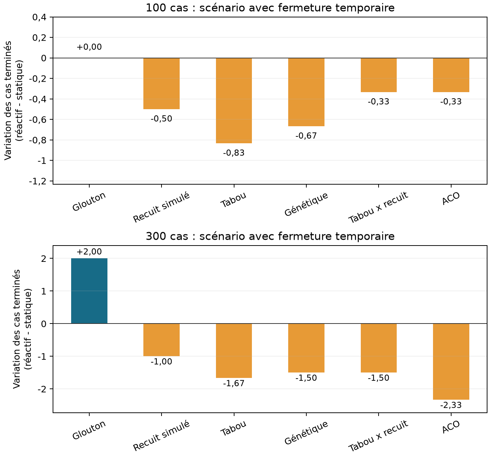

# Métaheuristiques et Mesa : comparaison expérimentale

28 septembre 2026 | Étude reproductible limitée aux salles d'opération

## 1. Objectif et périmètre

Ce rapport compare cinq métaheuristiques sur un même problème de planification de bloc opératoire, puis évalue leur couplage à une simulation Mesa. L'étude porte sur une petite instance dont toutes les solutions peuvent être énumérées, trois journées historiques et des charges de travail générées de plus grande taille.

L'implémentation est opérationnelle et la campagne comprend 576 exécutions. Elles correspondent à 144 plannings initiaux, chacun rejoué dans quatre combinaisons de politique et de scénario. L'expérience compare des algorithmes d'affectation sous un budget fixé ; elle n'établit pas un classement universel et ne reproduit pas les décisions réelles de l'hôpital.

Deux sens du terme « hybride » sont à distinguer. L'hybride Tabou x recuit combine deux algorithmes de recherche. Le couplage optimiseur-Mesa associe un planificateur à une simulation d'exécution et à une replanification réactive. Chacun des algorithmes peut participer à cette seconde forme d'hybridation.

La question principale est de savoir si une méthode trouve de meilleures affectations selon les durées prédites, puis si ces gains se retrouvent à l'exécution, avec des durées historiques cachées et une fermeture temporaire de salle. Ces deux résultats sont mesurés séparément.

**Lecture des résultats.** Réduire le nombre d'interventions non commencées constitue la première priorité. Le dépassement horaire doit être lu avec le nombre d'interventions terminées : laisser davantage de patients en attente peut donner un meilleur résultat sur le seul dépassement. Trois graines du solveur, c'est-à-dire trois initialisations du générateur aléatoire, et deux échantillons générés par taille permettent une comparaison descriptive, sans démontrer une supériorité statistique.

---

## 2. Données et agents représentant les épisodes

Le classeur nettoyé contient 14 507 lignes. La lecture conserve 14 434 épisodes et exclut 73 lignes, toutes en raison d'une heure d'entrée ou de sortie nulle dans cette version du fichier. Le classeur source n'est pas modifié.

| Champ source | Rôle dans cette expérience |
| --- | --- |
| date_inter | Sélection de la période d'apprentissage ou d'une journée d'évaluation |
| interv_type | Catégorie d'intervention normalisée, utilisée pour prédire la durée |
| Heures d'entrée et de sortie de salle | Calcul de la durée d'occupation réelle, cachée au solveur |
| no_cas | Tri déterministe interne uniquement ; remplacé par un identifiant local |
| Champs cliniques et de personnel | Non utilisés comme attributs de planification |

Les champs horaires exacts sont heure_d_entree_en_salle_d_operation_calimed et heure_de_sortie_de_salle_d_operation_calimed. Les valeurs manquantes, invalides ou nulles, ainsi que les intervalles de durée non positive, sont exclus. Une sortie antérieure à l'entrée n'est pas interprétée comme une intervention passant minuit.

Les estimations reposent sur 10 800 épisodes valides de 2019-2021. La médiane par type d'intervention n'est utilisée qu'avec au moins dix épisodes d'apprentissage ; sinon, la médiane globale d'apprentissage, de 70 minutes, est appliquée. Durées prédites et réelles sont arrondies à la minute supérieure. Les durées réelles et les heures futures de fin ne sont jamais transmises au solveur. Les débuts et les fins ne deviennent observables qu'au fil de l'exécution.

Un agent Mesa représente un épisode, avec un identifiant local, un type d'intervention, une durée prédite et un état : en attente, en cours ou terminé. La durée réelle appartient à la simulation d'exécution. Les salles sont des ressources, sans agents décisionnels propres. Aucun identifiant d'origine de patient ou de personnel n'est exporté dans les tableaux partagés du rapport.

Chaque journée historique est considérée comme une charge quotidienne complète, disponible dès l'ouverture. Les journées retenues (9, 15 et 25 cas) ne comportent aucune ligne source exclue. Celle de 9 cas est un exemple de faible volume ; celles de 15 et 25 cas correspondent à la médiane et au maximum des dates sans exclusion, classées par nombre de cas valides. Les charges générées échantillonnent avec remise des lignes valides de 2022 : le couple type d'intervention-durée réelle est conservé, mais les corrélations au sein d'une journée ne le sont pas.

---

## 3. Un problème d'optimisation commun

Une solution candidate affecte chaque cas en attente à une salle. Le décodeur commun ordonne les cas de chaque salle par durée prédite croissante, puis par identifiant local en cas d'égalité. Il respecte les disponibilités, le temps de remise en état entre interventions (turnover) et les fermetures connues. Un cas dont le début calculé tombe à la fermeture ou après est explicitement non affecté. Les interventions en cours et terminées sont préservées. Une intervention peut se terminer après la fermeture : en réaliser davantage peut donc entraîner un dépassement important.

La recherche porte sur les affectations, avec une règle d'ordre fixée. Elle n'explore pas toutes les séquences opératoires possibles. L'optimum exact présenté plus loin ne vaut donc que pour cette représentation et cet objectif.

Le coût prédit est minimisé selon cet ordre de priorité strict : nombre de cas en attente qui ne pourront pas commencer U, dépassement horaire O, puis nombre de décisions modifiées pour les cas en attente R. N est le nombre de cas en attente ; B est la somme de leurs durées prédites et des temps de remise en état :

**C = U + (O + R / (N + 1)) / (B + 1) ; fitness = -C.**

Comme R <= N et O <= B, un cas non commencé supplémentaire domine les termes de priorité inférieure. Une minute de dépassement domine toutes les modifications de décisions. Lors de la planification initiale, R = 0. L'activité déjà fixée apporte une constante : elle est exclue de l'objectif de recherche, mais reste incluse dans les indicateurs d'exécution. Des coûts calculés avec des dénominateurs différents ne doivent pas servir à classer les performances entre tailles ; U et O sont également à présenter.

**Que deviennent les coefficients 5, 3 et 0,05 ?** L'optimiseur initial de vacations minimise toujours : 5 x minutes de dépassement des vacations + 3 x journées-lits excédentaires + 0,05 x écart-type des charges des vacations. Ces poids de compromis sont des valeurs par défaut configurables dans le code ; cette campagne ne leur apporte aucune calibration clinique. Ils appartiennent à un autre modèle et ne sont pas utilisés dans la comparaison Mesa limitée aux salles. Comparer directement son score à C serait trompeur.

Toutes les méthodes partagent les mêmes prédictions, décodeur, validateur et solution de départ. Celle-ci provient d'une affectation gloutonne à l'initialisation, puis d'une réparation des affectations du planning accepté lors d'une replanification. Conserver le meilleur candidat évalué protège la valeur de l'objectif prédit, sans garantir le résultat réel à l'exécution.

---

## 4. Algorithmes exécutés

| Méthode | Mécanisme de recherche | Paramètres du couplage |
| --- | --- | --- |
| Glouton | Durée prédite la plus courte d'abord ; salle disponible au plus tôt | Affectation déterministe de référence |
| Recuit simulé | Un voisin ; acceptation probabiliste des dégradations | T0=1, refroidissement=0,95 |
| Tabou | Meilleur voisin admissible échantillonné ; mémoire des mouvements | 15 voisins, mémoire 20 |
| Génétique | Population, sélection pondérée par fitness, croisement en un point et mutation | Population 40, croisement 0,8, mutation 0,08, élitisme |
| Tabou x recuit | Choix du candidat par recherche taboue, puis acceptation par recuit | 15 voisins, mémoire 20, T0=1, refroidissement=0,97 |
| ACO | Construction d'affectations à partir des phéromones et de la charge des salles | 15 fourmis, alpha=1, beta=2, évaporation=0,3, Q=1 |

Les mouvements locaux réaffectent un cas ou échangent des affectations. Le critère d'aspiration autorise un mouvement tabou qui améliore le meilleur score ; si tous les candidats échantillonnés sont tabous, l'implémentation choisit le meilleur d'entre eux. La population génétique inclut la solution de départ. ACO mémorise cette solution comme meilleure solution courante pendant que les fourmis construisent de nouvelles affectations.

**Fonctionnement d'ACO.** Pour le cas i et la salle j, la probabilité de choix est proportionnelle à tau(i,j)^alpha x eta(j)^beta. Ici, eta(j) = 1 / (1 + charge prédite accumulée(j) / capacité restante(j)). Cette règle favorise les salles relativement peu chargées ; elle ne constitue pas un test complet de faisabilité. Le décodeur commun applique les règles de remise en état, de fermeture temporaire et de fin de journée lors de l'évaluation de l'affectation complète. L'heuristique de charge utilisée pendant la construction n'inclut pas elle-même la remise en état.

Après 15 fourmis, les phéromones sont multipliées par 0,7. Les affectations de la meilleure fourmi de l'itération reçoivent un dépôt supplémentaire de 1 / (1 + C). La meilleure solution parmi tous les candidats évalués est conservée. Les phéromones sont réinitialisées à chaque demande de planification ; la simulation ne conserve pas une colonie entre deux demandes.

Les paramètres sont les valeurs fixées pour cette étude dans l'implémentation, avec les deux températures initiales adaptées à l'objectif normalisé. Aucun réglage expérimental des hyperparamètres n'est revendiqué. Un même budget d'appels à la fitness produit des nombres d'itérations ou de générations différents et n'implique pas un temps de calcul identique.

---

## 5. Assemblage de Mesa et de l'optimiseur

La boucle de commande est la suivante : charge historique -> affectation initiale selon les prédictions -> validation et acceptation -> exécution Mesa -> fermeture ou réouverture observée -> nouvelle demande pour les cas en attente -> validation et acceptation -> poursuite de l'exécution.

Mesa 3.5.1 avance par pas d'une minute. À chaque minute, le modèle traite, dans cet ordre, les fins d'intervention et de remise en état, les changements de disponibilité, la synchronisation de l'état, une éventuelle replanification et les débuts autorisés. Il lit le planning actuellement accepté au lieu de programmer à l'avance des déclenchements de début susceptibles de devenir obsolètes.

La politique statique conserve les affectations et l'ordre initiaux par salle. Les retards décalent les débuts suivants. La politique réactive part exactement du même planning initial sauvegardé et replanifie à la fermeture temporaire puis à la réouverture. La fermeture n'est révélée qu'à son début ; son heure de fin est alors connue. Un dépassement de durée prédite ne déclenche pas à lui seul de replanification.

L'optimiseur reçoit les prédictions, les états observés, les disponibilités estimées et les engagements fixes. Le temps restant d'une intervention en cours est estimé à partir de sa prédiction initiale et du temps écoulé, jamais à partir de sa fin cachée. Les contrôles d'exécution empêchent tout chevauchement si cette estimation est optimiste. Une intervention en cours se termine normalement pendant une fermeture temporaire ; seuls les nouveaux débuts sont interdits.

Le contrat reste Scheduler.propose(request). L'adaptateur lance les recherches non triviales dans un processus distinct, transmet les meilleures solutions courantes et respecte un budget d'évaluations ainsi qu'une limite de temps de sécurité. Le temps simulé est suspendu pendant l'optimisation. Le coordinateur vérifie la couverture des cas, l'unicité des affectations, la faisabilité des salles et calendriers et les engagements fixes avant acceptation. En cas d'échec, les contrôles d'exécution continuent de protéger le planning en vigueur.

Il s'agit d'un couplage centralisé entre simulation et optimisation. Les agents patients portent l'état des épisodes ; ils ne négocient pas et n'optimisent pas de façon autonome. Un autre planificateur peut être intégré sans modifier l'exécution Mesa, à condition de renvoyer la même structure de planning et d'utiliser uniquement les données visibles de la demande.

---

## 6. Protocole expérimental et indicateurs

| Famille | Charges de travail | Graines du solveur | Exécutions |
| --- | --- | --- | --- |
| Petite instance exacte | 7 cas, 2 salles, 128 affectations | 0, 1, 2 | 72 |
| Historique | 2022-01-03 : 9 ; 2022-02-02 : 15 ; 2022-10-20 : 25 cas | 0, 1, 2 | 216 |
| Générée | 100 et 300 cas ; graines d'échantillonnage 0 et 1 | 0, 1, 2 | 288 |

Chaque couple charge-graine est évalué avec six méthodes, deux politiques et deux scénarios de fermeture. Chaque recherche non triviale dispose de 1 000 appels à la fitness, initialisation et répétitions comprises, avec une limite de sécurité de 60 secondes. La référence gloutonne ne consomme aucun appel de recherche. Les demandes avec zéro ou un seul cas en attente utilisent un traitement trivial ou exact, éventuellement moins coûteux. Une exécution réactive peut consommer jusqu'à trois budgets de demande ; son effort total de calcul n'est donc pas égal à celui de la politique statique.

Les journées historiques et générées ouvrent de 08:00 à 17:00, avec 15 minutes de remise en état. Les journées historiques utilisent deux salles synthétiques identiques. La petite instance ouvre de 08:00 à 11:00. La salle 1 interdit les nouveaux débuts de 10:00 à 12:00, ou de 09:00 à 10:00 pour la petite instance. Les plannings initiaux ne connaissent pas cette fermeture future.

Pour les charges générées, le nombre de salles est le plafond de : durée prédite totale, remise en état comprise / (540 x 1,1). La charge cible de 1,1 met volontairement la capacité sous tension ; l'arrondi modifie le ratio obtenu. Cette campagne n'étudie pas la sensibilité en faible charge. Une seule salle ferme : la perturbation touche donc une part plus faible de la capacité quand le nombre de salles augmente.

Les cas terminés incluent ceux qui finissent après la fermeture ; les cas encore en attente à la fermeture sont non commencés. Le dépassement est la somme, sur les salles, de l'occupation réelle et de la remise en état requise après la fermeture ; il ne correspond pas à la dernière heure de fin. L'utilisation mesure l'occupation pendant les heures d'ouverture, hors remise en état, divisée par toutes les heures-salles configurées, fermeture temporaire comprise.

Le retard vaut max(0, début réel - début initialement prévu). Il n'est mesuré que pour les cas terminés qui avaient une affectation initiale. Les cas ajoutés au planning et les cas non commencés sont exclus : cet indicateur a donc son propre dénominateur. Les décisions modifiées sont comptées à chaque replanification ; un même cas peut être compté deux fois. Le temps de calcul inclut le démarrage du processus et les communications. Il s'agit de mesures locales de bout en bout, et non du seul cœur algorithmique.

---

## 7. Petite instance : comparaison à l'optimum exact

La petite instance contient des durées prédites de 30, 40, 50, 60, 70, 80 et 90 minutes ; les durées réelles cachées sont de 35, 50, 45, 80, 65, 100 et 120 minutes. L'énumération exhaustive évalue les 2^7 = 128 affectations aux salles avec le décodeur commun.

L'objectif initial exact vaut U=0, O=165 minutes et C=0,313688. L'écart ci-dessous est le coût prédit du candidat moins ce coût exact. Chaque ligne regroupe trois graines du solveur sur une même instance ; les répétitions gloutonnes sont identiques et ne constituent pas des échantillons indépendants.

| Méthode | Écart moyen | Écart maximal | Optima / 3 | Calcul initial (s) |
| --- | --- | --- | --- | --- |
| Glouton | 0,80 | 0,80 | 0 | 0,00 |
| Recuit simulé | 0,00 | 0,00 | 3 | 0,52 |
| Tabou | 0,00 | 0,00 | 3 | 0,52 |
| Génétique | 0,00 | 0,00 | 3 | 0,52 |
| Tabou x recuit | 0,00 | 0,00 | 3 | 0,54 |
| ACO | 0,00 | 0,00 | 3 | 0,57 |

Les cinq métaheuristiques atteignent l'optimum initial exact pour les trois graines. La référence gloutonne prévoit un cas non commencé et présente un écart de coût d'environ 0,8004. Cela montre l'intérêt de rechercher une affectation sur cette instance, sans départager les cinq méthodes.

Cet optimum ne certifie que l'affectation initiale selon les prédictions, avec l'ordre fixé par durée croissante. Il ne certifie ni l'exécution optimale avec les durées cachées, ni un optimum après perturbation. Répéter les graines explore la variabilité du solveur sur cette seule instance, pas la diversité des petits problèmes.

---

## 8. Journées historiques : résultats d'exécution

Scénario avec fermeture temporaire. S = statique ; R = réactif. « Finies » désigne le nombre moyen d'interventions terminées ; « Dép. » le dépassement moyen, remise en état comprise, en minutes cumulées sur les salles. Chaque moyenne porte sur trois graines pour une date historique donnée. Les résultats agrégés détaillés conservent chaque graine et les deux scénarios.

| Charge | Méthode | Finies S | Finies R | Dép. S | Dép. R |
| --- | --- | --- | --- | --- | --- |
| 2022-01-03 | Glouton | 9,00 | 9,00 | 64,00 | 92,00 |
| 2022-01-03 | Recuit simulé | 9,00 | 9,00 | 7,33 | 44,67 |
| 2022-01-03 | Tabou | 9,00 | 9,00 | 15,67 | 57,33 |
| 2022-01-03 | Génétique | 9,00 | 9,00 | 61,00 | 95,00 |
| 2022-01-03 | Tabou x recuit | 9,00 | 9,00 | 15,67 | 57,33 |
| 2022-01-03 | ACO | 9,00 | 9,00 | 10,33 | 41,00 |
| 2022-02-02 | Glouton | 11,00 | 11,00 | 59,00 | 113,00 |
| 2022-02-02 | Recuit simulé | 11,67 | 11,33 | 135,33 | 109,33 |
| 2022-02-02 | Tabou | 12,00 | 11,33 | 158,67 | 108,00 |
| 2022-02-02 | Génétique | 11,67 | 11,00 | 115,00 | 68,00 |
| 2022-02-02 | Tabou x recuit | 12,00 | 11,33 | 158,67 | 108,00 |
| 2022-02-02 | ACO | 11,67 | 11,33 | 154,67 | 121,33 |
| 2022-10-20 | Glouton | 16,00 | 16,00 | 110,00 | 77,00 |
| 2022-10-20 | Recuit simulé | 16,00 | 16,00 | 110,00 | 74,00 |
| 2022-10-20 | Tabou | 16,00 | 16,00 | 110,00 | 75,67 |
| 2022-10-20 | Génétique | 16,00 | 16,00 | 110,00 | 73,67 |
| 2022-10-20 | Tabou x recuit | 16,00 | 16,00 | 110,00 | 75,67 |
| 2022-10-20 | ACO | 16,00 | 16,00 | 110,00 | 82,67 |

Les comparaisons sont appariées : chaque paire S/R partage son planning initial et ses durées réelles. Sans fermeture temporaire, toutes les paires donnent les mêmes résultats de complétion, de dépassement, d'occupation et de retard total. La comparaison isole donc l'effet de la replanification déclenchée par la fermeture, pour chaque méthode initiale.

---

## 9. Charges générées : taille et exécution

Scénario avec fermeture temporaire. S = statique ; R = réactif. « Finies » désigne le nombre moyen d'interventions terminées ; « Dép. » le dépassement moyen, remise en état comprise, en minutes cumulées sur les salles. Chaque moyenne porte sur deux charges échantillonnées et trois graines du solveur, soit six exécutions. Les résultats agrégés détaillés conservent chaque graine et les deux scénarios.

| Charge | Méthode | Finies S | Finies R | Dép. S | Dép. R |
| --- | --- | --- | --- | --- | --- |
| 100 | Glouton | 97,00 | 97,00 | 933,50 | 1022,00 |
| 100 | Recuit simulé | 96,67 | 96,17 | 952,50 | 958,50 |
| 100 | Tabou | 96,50 | 95,67 | 876,00 | 856,00 |
| 100 | Génétique | 97,00 | 96,33 | 933,50 | 971,67 |
| 100 | Tabou x recuit | 96,50 | 96,17 | 876,00 | 932,83 |
| 100 | ACO | 96,33 | 96,00 | 902,50 | 976,00 |
| 300 | Glouton | 287,50 | 289,50 | 2838,00 | 3319,50 |
| 300 | Recuit simulé | 287,33 | 286,33 | 2923,00 | 3028,50 |
| 300 | Tabou | 289,00 | 287,33 | 3021,50 | 3140,50 |
| 300 | Génétique | 287,50 | 286,00 | 2838,00 | 2974,50 |
| 300 | Tabou x recuit | 289,00 | 287,50 | 3021,50 | 3165,50 |
| 300 | ACO | 287,50 | 285,17 | 2838,00 | 3000,50 |

Les comparaisons sont appariées : chaque paire S/R partage son planning initial et ses durées réelles. Sans fermeture temporaire, toutes les paires donnent les mêmes résultats de complétion, de dépassement, d'occupation et de retard total. La comparaison isole donc l'effet de la replanification déclenchée par la fermeture, pour chaque méthode initiale.

---

## 10. Grandes instances : qualité prédite et calcul

Planification initiale uniquement : six observations par méthode et par taille, soit deux instances échantillonnées et trois graines. Le nombre prédit de cas non commencés et le dépassement prédit sont présentés séparément, car les coûts normalisés ne sont pas directement comparables entre tailles. Le temps inclut le démarrage du processus. Les petites instances, les journées historiques et les charges de 100 cas ont été exécutées séquentiellement ; celles de 300 cas ont utilisé quatre lots concurrents. Leurs temps de recherche incluent le partage du processeur : la comparaison des temps entre tailles reste descriptive, sans contrôle expérimental de la vitesse.

| Cas | Méthode | U prédit | Dép. prédit | Moy. (s) | Max. (s) |
| --- | --- | --- | --- | --- | --- |
| 100 | ACO | 0,00 | 616,17 | 1,37 | 1,40 |
| 100 | Recuit simulé | 0,00 | 602,00 | 0,70 | 0,74 |
| 100 | Glouton | 0,00 | 668,00 | 0,00 | 0,00 |
| 100 | Génétique | 0,00 | 668,00 | 0,70 | 0,71 |
| 100 | Tabou x recuit | 0,00 | 602,00 | 0,68 | 0,72 |
| 100 | Tabou | 0,00 | 602,00 | 0,68 | 0,71 |
| 300 | ACO | 0,00 | 2195,00 | 3,71 | 3,84 |
| 300 | Recuit simulé | 0,00 | 1908,00 | 1,10 | 1,14 |
| 300 | Glouton | 0,00 | 2195,00 | 0,01 | 0,01 |
| 300 | Génétique | 0,00 | 2195,00 | 1,13 | 1,18 |
| 300 | Tabou x recuit | 0,00 | 1905,50 | 1,09 | 1,10 |
| 300 | Tabou | 0,00 | 1905,50 | 1,11 | 1,13 |

À 100 cas, la recherche taboue réduit le dépassement prédit moyen de 668,0 à 602,0 minutes ; le recuit et Tabou x recuit atteignent la même moyenne. À 300 cas, tabou et Tabou x recuit atteignent 1 905,5 minutes contre 2 195,0 pour la référence. L'algorithme génétique conserve la solution de départ aux deux tailles ; ACO la conserve à 300 cas. Sous ce budget, les recherches locales améliorent plus régulièrement la qualité prédite ; les tableaux d'exécution montrent pourquoi cela ne désigne pas un vainqueur universel.

Ressources générées : sample-100-0, 14 salles ; sample-100-1, 15 salles ; sample-300-0, 44 salles ; sample-300-1, 45 salles. Augmenter le nombre de salles avec celui des cas évite de confondre entièrement croissance du problème et pénurie de ressources, même si la charge cible est volontairement supérieure à un.

La méthode gloutonne fournit une référence de calcul utile, mais ne réalise aucune évaluation de recherche et ne lance aucun processus de recherche séparé. ACO construit des affectations complètes pour chaque fourmi et calcule des probabilités supplémentaires pour chaque cas. Le temps doit donc être lu avec la qualité, et non déduit du seul nombre d'évaluations. Cette étude limitée ne dispose ni d'un optimum exact pour les grandes instances, ni d'un écart à l'optimum certifié pour ces tailles.

---

## 11. Référence d'exécution sans fermeture temporaire

Politique statique ; la politique réactive donne les mêmes résultats opérationnels puisqu'aucun événement ne déclenche de replanification. Les moyennes portent sur trois graines par instance. Les moyennes historiques regroupent trois journées différentes et doivent être lues avec le tableau par date, plutôt que comme une journée hospitalière représentative. Les moyennes générées utilisent deux échantillons par taille.

| Famille | Méthode | Terminés | Non commencés | Dép. (min) |
| --- | --- | --- | --- | --- |
| Petite | Glouton | 6,00 | 1,00 | 105,00 |
| Petite | Recuit simulé | 5,67 | 1,33 | 86,67 |
| Petite | Tabou | 6,00 | 1,00 | 135,00 |
| Petite | Génétique | 6,00 | 1,00 | 111,67 |
| Petite | Tabou x recuit | 6,00 | 1,00 | 135,00 |
| Petite | ACO | 5,67 | 1,33 | 100,00 |
| Historique | Glouton | 12,67 | 3,67 | 96,67 |
| Historique | Recuit simulé | 12,67 | 3,67 | 74,67 |
| Historique | Tabou | 12,78 | 3,56 | 84,78 |
| Historique | Génétique | 12,78 | 3,56 | 87,56 |
| Historique | Tabou x recuit | 12,78 | 3,56 | 84,78 |
| Historique | ACO | 12,56 | 3,78 | 65,00 |
| Générée 100 | Glouton | 97,50 | 2,50 | 922,00 |
| Générée 100 | Recuit simulé | 97,17 | 2,83 | 942,67 |
| Générée 100 | Tabou | 97,17 | 2,83 | 874,67 |
| Générée 100 | Génétique | 97,50 | 2,50 | 922,00 |
| Générée 100 | Tabou x recuit | 97,17 | 2,83 | 874,67 |
| Générée 100 | ACO | 97,17 | 2,83 | 908,50 |
| Générée 300 | Glouton | 287,50 | 12,50 | 2779,00 |
| Générée 300 | Recuit simulé | 288,00 | 12,00 | 2949,67 |
| Générée 300 | Tabou | 289,17 | 10,83 | 2965,00 |
| Générée 300 | Génétique | 287,50 | 12,50 | 2779,00 |
| Générée 300 | Tabou x recuit | 289,17 | 10,83 | 2965,00 |
| Générée 300 | ACO | 287,50 | 12,50 | 2779,00 |

Ces résultats utilisent les durées réelles. Ils se distinguent de l'objectif initial prédit et rendent visible l'effet de l'incertitude sur les durées, même sans fermeture temporaire.

---

## 12. Interprétation et limites

Sur les 144 paires avec fermeture, la politique réactive termine davantage de cas dans 16 paires, autant dans 83 et moins dans 45. Ces comptes incluent des répétitions déterministes de la référence et des charges hétérogènes ; ils sont descriptifs et ne constituent pas des essais statistiques indépendants. Le dépassement diminue dans 64 paires, reste inchangé dans 7 et augmente dans 73.

Le 2022-01-03, toutes les méthodes terminent neuf cas sous les deux politiques, mais le dépassement est supérieur en réactif. Le 2022-02-02, certaines méthodes réduisent le dépassement au prix d'un nombre inférieur de cas terminés. Le 2022-10-20, toutes terminent 16 cas sous les deux politiques, tandis que la replanification réduit le dépassement. Ces différences entre journées montrent les limites d'une moyenne unique ou d'un exemple favorable isolé.

Le résultat principal est que l'hybridation est techniquement réalisable, mais que replanifier n'est pas automatiquement bénéfique. La recherche optimise des prédictions. Les erreurs de durée, l'ordre fixé dans les salles et l'interdiction de démarrer avant l'heure planifiée peuvent modifier le résultat réel. Replanifier peut améliorer un indicateur au détriment d'un autre. Un dépassement réduit accompagné de moins de cas terminés ne constitue pas une amélioration sans réserve.

Ces expériences ne justifient aucun vainqueur global. Une seule petite instance exacte, trois journées historiques choisies et deux échantillons générés par taille ont été évalués, avec trois graines et un seul budget d'évaluations. Les journées historiques ne reconstituent ni les disponibilités réelles des salles, ni les effectifs, les compatibilités de spécialité, les lits, les arrivées urgentes ou les priorités propres à l'hôpital. Les cas générés conservent le couple individuel type-durée, mais pas les dépendances quotidiennes ni les contraintes de composition clinique.

L'effort total de recherche et la sévérité relative de la perturbation varient selon les comparaisons : une exécution réactive peut demander davantage de résolutions, et une salle fermée représente une fraction moindre d'un grand ensemble de salles. Le temps simulé est suspendu pendant le calcul ; la latence d'optimisation ne retarde donc pas elle-même une intervention. Ces choix doivent rester présents dans l'interprétation des tableaux.

Une extension utile serait une campagne d'évaluation sur davantage de dates et d'échantillons générés, plusieurs budgets et des conditions de faible charge comme de surcharge. Le réglage des algorithmes et des modèles de durée devrait utiliser des données de développement distinctes. Un déploiement clinique nécessiterait en plus des contraintes validées et une évaluation prospective ; ce rapport établit une comparaison expérimentale reproductible dans le modèle actuel.

---

## 13. Vérification, provenance et reproduction

Le générateur du rapport a vérifié indépendamment les 576 exécutions : conservation des cas, règles de début à l'ouverture et à la fermeture, fermeture temporaire, absence de chevauchement, respect de la remise en état, totaux d'occupation et de dépassement, et plafonds d'évaluations. Il a également vérifié l'égalité des résultats opérationnels de toutes les paires sans fermeture temporaire. La campagne ne présente aucun échec du coordinateur ou du solveur, aucune expiration de délai et aucun arrêt sur limite de temps. La validation antérieure de l'implémentation comptait 90 tests : 88 réussis et deux tests Tkinter facultatifs ignorés. Ils n'ont pas été relancés pour cette campagne documentaire.

Commit évalué : 1ee8d0860cb72aaba25f8536929871773fbcea45. Python 3.12.3 ; Mesa 3.5.1. Les versions exactes des dépendances, empreintes du code et du classeur et ressources générées sont conservées dans comparison-results/provenance.json. Les charges de 300 cas ont utilisé quatre lots concurrents, comme l'indique le manifeste correspondant. Les manifestes locaux peuvent signaler des modifications non commitées après l'ajout des scripts documentaires ; l'empreinte des sources de simulation identifie le code évalué.

Pour reproduire les expériences depuis la racine du dépôt :

`bash scripts/run_comparison_campaign.sh artifacts/comparison-rerun`

Puis générer le rapport anglais, après installation de la dépendance documentaire facultative avec venv/bin/python -m pip install reportlab==5.0.1 :

`venv/bin/python scripts/build_comparison_report.py --input artifacts/comparison-rerun`

Pour régénérer le PDF français à partir de la présente traduction et des résultats agrégés :

`venv/bin/python scripts/render_french_comparison.py`

Le classeur nettoyé est nécessaire aux expériences historiques et générées. Les journaux d'épisodes restent dans artifacts/, ignoré par Git. Les tableaux partageables sont docs/comparison-results/runs.csv et initial-plans.csv. La version française modifiable est docs/metaheuristics-mesa-comparison-fr.md. Le PDF français est produit dans artifacts/comparison-2026-09-28/ ; son graphique se trouve dans docs/comparison-results/. La traduction conserve les résultats de la campagne d'origine ; régénérer sa mise en page ne relance pas les expériences.

Sources de l'implémentation : hospital_sim/historical_data.py pour les champs et la séparation apprentissage-évaluation ; room_problem.py pour le décodeur et l'objectif ; metaheuristics.py pour les adaptateurs et paramètres ; simulation.py pour Mesa et les indicateurs ; experiment.py et instances.py pour le protocole ; optimiseur/optimizer.py et search_control.py pour les recherches et leurs budgets. Ce rapport décrit et évalue cette implémentation ; il ne constitue pas une revue de littérature et n'apporte aucune preuve clinique externe.

---

## 14. Indicateurs d'exécution complémentaires

Scénario avec fermeture temporaire, politique réactive uniquement. Le retard est calculé en regroupant les cas terminés admissibles ; l'utilisation, les décisions modifiées et le temps total du solveur sont des moyennes non pondérées entre exécutions. Le temps inclut la résolution initiale sauvegardée et les replanifications. Le CSV agrégé contient toutes les politiques et tous les scénarios.

| Famille | Méthode | Retard (min) | Utilisation (%) | Modifications | Solveur (s) |
| --- | --- | --- | --- | --- | --- |
| Petite | Glouton | 9,17 | 80,56 | 3,00 | 0,00 |
| Petite | Recuit simulé | 4,41 | 77,31 | 4,00 | 1,56 |
| Petite | Tabou | 9,67 | 72,69 | 4,33 | 1,57 |
| Petite | Génétique | 7,81 | 75,93 | 4,33 | 1,60 |
| Petite | Tabou x recuit | 9,67 | 72,69 | 4,33 | 1,59 |
| Petite | ACO | 13,53 | 79,17 | 5,00 | 1,67 |
| Historique | Glouton | 38,86 | 68,92 | 13,00 | 0,00 |
| Historique | Recuit simulé | 35,81 | 70,83 | 11,67 | 1,62 |
| Historique | Tabou | 38,67 | 70,42 | 10,67 | 1,62 |
| Historique | Génétique | 40,68 | 69,84 | 11,89 | 1,63 |
| Historique | Tabou x recuit | 38,67 | 70,42 | 10,67 | 1,62 |
| Historique | ACO | 38,95 | 70,13 | 11,11 | 1,84 |
| Générée 100 | Glouton | 24,15 | 77,09 | 109,00 | 0,01 |
| Générée 100 | Recuit simulé | 36,26 | 77,40 | 96,17 | 1,98 |
| Générée 100 | Tabou | 27,21 | 77,51 | 70,33 | 1,95 |
| Générée 100 | Génétique | 25,62 | 76,92 | 77,67 | 1,97 |
| Générée 100 | Tabou x recuit | 27,25 | 77,55 | 70,67 | 1,95 |
| Générée 100 | ACO | 39,31 | 77,48 | 111,33 | 3,43 |
| Générée 300 | Glouton | 23,81 | 79,06 | 321,50 | 0,04 |
| Générée 300 | Recuit simulé | 39,13 | 79,80 | 314,17 | 3,02 |
| Générée 300 | Tabou | 28,80 | 79,59 | 236,33 | 3,05 |
| Générée 300 | Génétique | 23,80 | 78,99 | 228,50 | 3,05 |
| Générée 300 | Tabou x recuit | 28,66 | 79,55 | 236,50 | 3,00 |
| Générée 300 | ACO | 25,91 | 78,70 | 246,00 | 8,35 |

La population du calcul de retard peut varier entre méthodes, car les cas non commencés et ceux sans affectation initiale sont exclus. Les décisions modifiées sont des événements de révision, pas un nombre de patients distincts. Ces indicateurs doivent être lus avec les cas terminés et le dépassement, sans les combiner dans un nouveau score non documenté.

---

## 15. Charges générées : comparaison appariée des politiques

Différences moyennes appariées sur deux charges et trois graines du solveur. Une valeur positive indique davantage d'interventions terminées en réactif ; une valeur négative en indique moins. Chaque paire partage son planning initial et ses durées cachées. À lire avec le dépassement horaire ; les barres sont des moyennes descriptives, pas des intervalles de confiance.
