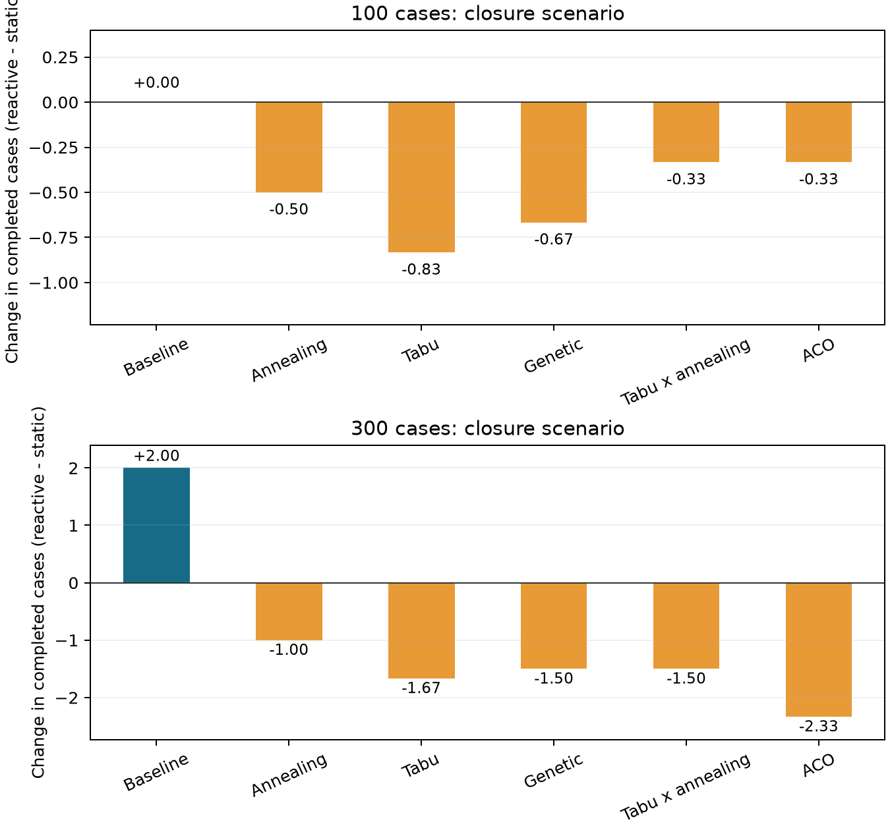

# Metaheuristics and Mesa: experimental comparison

28 September 2026 | Reproducible room-only study

## 1. Purpose and scope

This report compares five metaheuristics on a common operating-room scheduling problem, then evaluates their coupling to a Mesa simulation. It covers an exactly enumerable small instance, three historical daily workloads, and larger generated workloads.

The implementation is working and the campaign contains 576 execution runs. These represent 144 initial plans replayed under four policy/scenario combinations. The experiment compares allocation algorithms under a fixed budget; it does not establish a universal ranking or reproduce the hospital's actual decisions.

Two distinct uses of “hybrid” must be separated. Tabu x annealing combines two search algorithms. Optimizer-Mesa coupling combines a scheduler with an execution simulation and reactive replanning. Every search algorithm can participate in the second form of hybridization.

The main question is whether a method finds better predicted room allocations and whether those gains survive execution with hidden historical durations and a temporary room closure. The two outcomes are measured separately.

**Reading the results.** Fewer unstarted cases is the first priority. Overtime must be read alongside case completion: a plan that leaves more patients waiting may appear better on overtime alone. Three solver seeds and two generated samples per size support a descriptive comparison, not a claim of statistical superiority.

---

## 2. Data and patient-episode agents

The cleaned workbook contains 14,507 rows. Parsing retains 14,434 episodes and excludes 73 rows, all because of zero clock endpoints in this version of the file. The source workbook is not modified.

| Source field | Role in this experiment |
| --- | --- |
| date_inter | Select the training period or a held-out daily workload |
| interv_type | Normalized procedure category used to predict duration |
| Room entry and exit clocks | Calculate hidden realized room occupancy |
| no_cas | Internal deterministic ordering only; replaced by local case IDs |
| Clinical/personnel fields | Not used as scheduling attributes |

The exact clock fields are heure_d_entree_en_salle_d_operation_calimed and heure_de_sortie_de_salle_d_operation_calimed. Missing, invalid, zero or nonpositive intervals are excluded; exit-before-entry is not interpreted as overnight surgery.

Duration estimates use 10,800 valid episodes from 2019-2021. A procedure median is used only with at least ten training episodes; otherwise the global training median is 70 minutes. Predicted and realized durations are rounded upward to whole minutes. Realized durations and future completion times are never supplied to the scheduler. Starts and completions become observable only as execution occurs.

A Mesa agent represents one episode, with a local ID, procedure, prediction and waiting/running/completed state. Realized duration belongs to execution. Rooms are resources, not deliberating agents. No original patient or personnel identifiers are exported in the shared report tables.

Historical days are treated as complete daily workloads ready at opening. The selected days (9, 15 and 25 cases) have no excluded source rows. The 9-case day is a convenient low-volume example; the 15-case day is the median and the 25-case day the maximum among dates without exclusions, ordered by valid case count. Generated workloads sample valid 2022 rows with replacement, keeping procedure and outcome paired; they do not preserve within-day correlations.

---

## 3. A common optimization problem

A candidate assigns every waiting case to a room. The shared decoder orders cases within each room by ascending predicted duration, breaking ties by local ID. It respects availability, turnover and known closures. A case whose decoded start is at or after closing is explicitly unassigned. Running and completed cases are preserved. Finishes are allowed after closing, so completing more cases can entail substantial overtime.

This is an allocation search with a fixed sequencing rule. It does not search all possible surgical sequences. The exact optimum below is therefore exact only within this representation and the stated objective.

The predicted cost is minimized in the following strict order: unstarted waiting cases U, overtime O, then changed waiting decisions R. With N waiting cases and B equal to their total predicted duration plus turnover:

**C = U + (O + R / (N + 1)) / (B + 1); fitness = -C.**

Since R <= N and O <= B, one additional unstarted case dominates the lower-priority terms. One overtime minute dominates all decision changes. At initial planning R = 0. Fixed activity contributes a constant and is excluded from the request objective, but remains in execution metrics. Costs with different denominators should not be used as a cross-size performance ranking; report U and O as well.

**What happened to 5, 3 and 0.05?** The native vacation optimizer still minimizes 5 x excess vacation minutes + 3 x excess bed-days + 0.05 x standard deviation of vacation loads. These are configurable default trade-off weights in the code; this campaign supplies no clinical calibration for them. They belong to a different model and are not used in the room-only Mesa comparison. Comparing its raw scores with C would be misleading.

All methods share the same prediction inputs, decoder, validator and starting incumbent. The incumbent is a greedy allocation initially and a repaired allocation from the accepted plan during replanning. Keeping the best evaluated candidate protects the predicted objective, not the realized hospital outcome.

---

## 4. Algorithms actually executed

| Method | Search mechanism | Coupled settings |
| --- | --- | --- |
| Baseline | Shortest prediction first; earliest feasible room | Deterministic greedy allocation |
| Annealing | One neighboring allocation; accept worsening moves probabilistically | T0=1, cooling=0.95 |
| Tabu | Best admissible sampled neighbor; memory discourages repeated moves | 15 neighbors, memory 20 |
| Genetic | Population, fitness-weighted selection, one-point crossover and mutation | Population 40, crossover 0.8, mutation 0.08, elitism |
| Tabu x annealing | Tabu candidate selection followed by annealing acceptance | 15 neighbors, memory 20, T0=1, cooling=0.97 |
| ACO | Construct allocations using pheromone and current room load | 15 ants, alpha=1, beta=2, evaporation=0.3, Q=1 |

Local moves reassign a case or swap assignments. Tabu aspiration permits a tabu move that improves the best score; if all sampled candidates are tabu, the implementation uses the best sampled candidate. The genetic population includes the incumbent. ACO records the incumbent as a best-so-far candidate while its ants construct new allocations.

**ACO in detail.** For case i and room j, selection probability is proportional to tau(i,j)^alpha x eta(j)^beta. Here eta(j) = 1 / (1 + accumulated predicted load(j) / remaining capacity(j)). This favors relatively lightly loaded rooms; it is not a full feasibility test. The common decoder applies turnover, closure and closing rules when evaluating the complete allocation. The constructive load heuristic itself does not include turnover.

After 15 ants, pheromone is multiplied by 0.7. Assignments used by the best ant of that iteration receive 1 / (1 + C) additional pheromone. The best solution found across all evaluated candidates is retained. Pheromone is initialized afresh for each scheduling request; the simulation does not maintain an inter-request ant colony.

The settings are fixed implementation defaults for this study, with the two initial temperatures adapted to the normalized objective. No hyperparameter tuning is claimed. Equal fitness-call budgets produce different numbers of iterations or generations and do not imply equal elapsed time.

---

## 5. How Mesa and the optimizer are assembled

The control loop is: historical workload -> predicted initial allocation -> validation and acceptance -> Mesa execution -> observed room closure/reopening -> a new request for waiting cases -> validation and acceptance -> continued execution.

Mesa 3.5.1 advances in one-minute steps. Each minute processes completions and turnover release, availability changes, state synchronization, optional replanning, and eligible starts in that order. The model reads the currently accepted plan rather than installing future start callbacks that could become obsolete.

Static execution preserves initial assignments and room order. Delays shift subsequent starts. Reactive execution starts from the exact same saved initial schedule and replans at closure and reopening. The closure is first revealed when it begins; its ending time is then known. There is no replanning merely because a duration overruns its prediction.

The optimizer receives predictions, observed statuses, availability estimates and fixed commitments. Remaining time for an ongoing case is estimated from its original prediction and elapsed time, never from its hidden finish. Execution guards prevent overlap when that estimate is optimistic. A running episode finishes normally during a closure; the closure only forbids new starts.

The contract remains Scheduler.propose(request). The adapter runs nontrivial searches in a separate process, reports incumbents and respects an evaluation budget and safety deadline. Simulated time pauses during optimization. The coordinator checks case coverage, uniqueness, room/calendar feasibility and fixed commitments before accepting a result. On failure, the current plan remains protected by execution guards.

This is centralized simulation-optimization coupling. Patient agents carry episode state; they do not negotiate or independently optimize. The architecture can accept another scheduler without changing Mesa execution, provided it returns the same schedule structure and uses only visible request data.

---

## 6. Experimental protocol and metric definitions

| Family | Workloads | Solver seeds | Execution runs |
| --- | --- | --- | --- |
| Small exact | 7 cases, 2 rooms, 128 allocations | 0, 1, 2 | 72 |
| Historical | 2022-01-03: 9; 2022-02-02: 15; 2022-10-20: 25 cases | 0, 1, 2 | 216 |
| Generated | 100 and 300 cases; sample seeds 0 and 1 | 0, 1, 2 | 288 |

Every workload/seed uses six methods, two policies and two closure scenarios. Each nontrivial search is allowed 1,000 fitness calls, counting initialization and repeats, with a 60-second safety deadline. Baseline uses no search calls. Requests with zero or one waiting case use trivial/exact handling and may consume less budget. A reactive run can use up to three request budgets, so it is not an equal-total-computation comparison against static scheduling.

Historical and generated opening hours are 08:00-17:00, with 15-minute turnover. Historical days use two identical synthetic rooms. Small-instance hours are 08:00-11:00. Room 1 closes to new starts from 10:00-12:00 (small: 09:00-10:00). Initial plans have no knowledge of the future closure.

Generated room counts are ceil(total predicted duration including turnover / (540 x 1.1)). The 1.1 target deliberately stresses capacity; rounding changes the achieved ratio. This campaign does not include a light-load sensitivity study. Only one room closes, so the disruption affects a smaller fraction of capacity as room count grows.

Completed cases include those finishing after closing; waiting cases at closing are unstarted. Overtime is actual room occupancy plus required turnover after closing, summed across rooms, not the latest wall-clock finish. Utilization counts occupancy within opening hours, excludes turnover and divides by all configured room-hours, including closure time.

Delay is max(0, actual start - initial planned start), measured only for completed cases that had an initial assignment. Newly scheduled cases and unstarted cases are excluded; delay therefore needs its own denominator. Changed decisions count revisions across replans and may count a case twice. Runtime includes worker startup and communication. These are local end-to-end measurements, not isolated algorithm kernel timings.

---

## 7. Small problem: comparison to the exact optimum

The small fixture has predicted durations 30, 40, 50, 60, 70, 80 and 90 minutes; hidden realized durations are 35, 50, 45, 80, 65, 100 and 120 minutes. Exhaustive enumeration evaluates all 2^7 = 128 room allocations through the common decoder.

The exact initial objective is U=0, O=165 minutes, C=0.313688. The gap below is candidate predicted cost minus that exact cost. Each row contains three solver seeds on one fixture; the baseline repetitions are identical, not independent samples.

| Method | Mean gap | Worst gap | Optima / 3 | Initial s |
| --- | --- | --- | --- | --- |
| Baseline | 0.80 | 0.80 | 0 | 0.00 |
| Annealing | 0.00 | 0.00 | 3 | 0.52 |
| Tabu | 0.00 | 0.00 | 3 | 0.52 |
| Genetic | 0.00 | 0.00 | 3 | 0.52 |
| Tabu x annealing | 0.00 | 0.00 | 3 | 0.54 |
| ACO | 0.00 | 0.00 | 3 | 0.57 |

All five metaheuristics reach the exact initial optimum for all three seeds. The greedy baseline leaves one predicted case unstarted and has a cost gap of about 0.8004. This shows a benefit from allocation search on the chosen fixture, without distinguishing the five methods.

An optimum here certifies only the initial predicted allocation under fixed shortest-duration sequencing. It does not certify optimal execution under the hidden durations, nor an optimum after a disruption. Repeating seeds explores solver variability on this one fixture; it does not test diversity of small problems.

---

## 8. Historical workloads: actual execution

Closure scenario. S = static; R = reactive. Done = mean completed cases; OT = mean overtime including turnover, in minutes summed over rooms. Each mean uses three solver seeds for a fixed historical date. Raw aggregate results preserve every seed and both scenarios.

| Workload | Method | Done S | Done R | OT S | OT R |
| --- | --- | --- | --- | --- | --- |
| 2022-01-03 | Baseline | 9.00 | 9.00 | 64.00 | 92.00 |
| 2022-01-03 | Annealing | 9.00 | 9.00 | 7.33 | 44.67 |
| 2022-01-03 | Tabu | 9.00 | 9.00 | 15.67 | 57.33 |
| 2022-01-03 | Genetic | 9.00 | 9.00 | 61.00 | 95.00 |
| 2022-01-03 | Tabu x annealing | 9.00 | 9.00 | 15.67 | 57.33 |
| 2022-01-03 | ACO | 9.00 | 9.00 | 10.33 | 41.00 |
| 2022-02-02 | Baseline | 11.00 | 11.00 | 59.00 | 113.00 |
| 2022-02-02 | Annealing | 11.67 | 11.33 | 135.33 | 109.33 |
| 2022-02-02 | Tabu | 12.00 | 11.33 | 158.67 | 108.00 |
| 2022-02-02 | Genetic | 11.67 | 11.00 | 115.00 | 68.00 |
| 2022-02-02 | Tabu x annealing | 12.00 | 11.33 | 158.67 | 108.00 |
| 2022-02-02 | ACO | 11.67 | 11.33 | 154.67 | 121.33 |
| 2022-10-20 | Baseline | 16.00 | 16.00 | 110.00 | 77.00 |
| 2022-10-20 | Annealing | 16.00 | 16.00 | 110.00 | 74.00 |
| 2022-10-20 | Tabu | 16.00 | 16.00 | 110.00 | 75.67 |
| 2022-10-20 | Genetic | 16.00 | 16.00 | 110.00 | 73.67 |
| 2022-10-20 | Tabu x annealing | 16.00 | 16.00 | 110.00 | 75.67 |
| 2022-10-20 | ACO | 16.00 | 16.00 | 110.00 | 82.67 |

These are paired comparisons: each S/R pair shares its initial plan and realized durations. No-outage policies match on completion, overtime, occupancy and total delay in all pairs. The comparisons therefore isolate the effect of the implemented closure-triggered replanning, conditional on each initial method.

---

## 9. Generated workloads: scaling and execution

Closure scenario. S = static; R = reactive. Done = mean completed cases; OT = mean overtime including turnover, in minutes summed over rooms. Each mean uses two sampled workloads x three solver seeds (six runs). Raw aggregate results preserve every seed and both scenarios.

| Workload | Method | Done S | Done R | OT S | OT R |
| --- | --- | --- | --- | --- | --- |
| 100 | Baseline | 97.00 | 97.00 | 933.50 | 1022.00 |
| 100 | Annealing | 96.67 | 96.17 | 952.50 | 958.50 |
| 100 | Tabu | 96.50 | 95.67 | 876.00 | 856.00 |
| 100 | Genetic | 97.00 | 96.33 | 933.50 | 971.67 |
| 100 | Tabu x annealing | 96.50 | 96.17 | 876.00 | 932.83 |
| 100 | ACO | 96.33 | 96.00 | 902.50 | 976.00 |
| 300 | Baseline | 287.50 | 289.50 | 2838.00 | 3319.50 |
| 300 | Annealing | 287.33 | 286.33 | 2923.00 | 3028.50 |
| 300 | Tabu | 289.00 | 287.33 | 3021.50 | 3140.50 |
| 300 | Genetic | 287.50 | 286.00 | 2838.00 | 2974.50 |
| 300 | Tabu x annealing | 289.00 | 287.50 | 3021.50 | 3165.50 |
| 300 | ACO | 287.50 | 285.17 | 2838.00 | 3000.50 |

These are paired comparisons: each S/R pair shares its initial plan and realized durations. No-outage policies match on completion, overtime, occupancy and total delay in all pairs. The comparisons therefore isolate the effect of the implemented closure-triggered replanning, conditional on each initial method.

---

## 10. Larger problems: predicted quality and computation

Initial planning only; six observations per method and size (two sampled instances, three solver seeds). The predicted unstarted count and overtime are reported separately because normalized costs are not directly comparable across sizes. Time includes process startup. Small, historical and 100-case runs were sequential; the 300-case workloads ran in four concurrent batches. Their measured search times include shared CPU load, so cross-size timings are descriptive and are not a controlled speed comparison.

| Cases | Method | Predicted U | Predicted OT | Mean s | Max s |
| --- | --- | --- | --- | --- | --- |
| 100 | ACO | 0.00 | 616.17 | 1.37 | 1.40 |
| 100 | Annealing | 0.00 | 602.00 | 0.70 | 0.74 |
| 100 | Baseline | 0.00 | 668.00 | 0.00 | 0.00 |
| 100 | Genetic | 0.00 | 668.00 | 0.70 | 0.71 |
| 100 | Tabu x annealing | 0.00 | 602.00 | 0.68 | 0.72 |
| 100 | Tabu | 0.00 | 602.00 | 0.68 | 0.71 |
| 300 | ACO | 0.00 | 2195.00 | 3.71 | 3.84 |
| 300 | Annealing | 0.00 | 1908.00 | 1.10 | 1.14 |
| 300 | Baseline | 0.00 | 2195.00 | 0.01 | 0.01 |
| 300 | Genetic | 0.00 | 2195.00 | 1.13 | 1.18 |
| 300 | Tabu x annealing | 0.00 | 1905.50 | 1.09 | 1.10 |
| 300 | Tabu | 0.00 | 1905.50 | 1.11 | 1.13 |

At 100 cases, tabu reduces mean predicted overtime from 668.0 to 602.0 minutes; annealing and Tabu x annealing reach the same mean. At 300 cases, tabu and Tabu x annealing reach 1905.5 versus 2195.0 for the baseline. Genetic search retains the initial incumbent at both sizes, and ACO does so at 300 cases. Under this budget, the local searches improve predicted quality more consistently; the execution tables show why that does not establish a universal winner.

Generated resources: sample-100-0: 14 rooms; sample-100-1: 15 rooms; sample-300-0: 44 rooms; sample-300-1: 45 rooms. Increasing rooms alongside cases avoids treating all growth as resource scarcity, although the target load is intentionally above one.

The baseline is a useful computational reference, but uses zero search evaluations and has no spawned search worker. ACO constructs whole allocations for each ant and has additional per-case probability calculations. Search time should therefore be compared alongside quality, not inferred from equal evaluation counts. This bounded study has no exact large-instance optimum or certified large-instance optimality gap.

---

## 11. No-closure execution reference

Static execution; reactive gives identical operational results because no replanning trigger occurs. Means cover three solver seeds per instance. Historical means pool three different days and must be interpreted with the per-day closure table, not as a single representative hospital day. Generated means use two samples per size.

| Family | Method | Completed | Unstarted | OT min |
| --- | --- | --- | --- | --- |
| Small | Baseline | 6.00 | 1.00 | 105.00 |
| Small | Annealing | 5.67 | 1.33 | 86.67 |
| Small | Tabu | 6.00 | 1.00 | 135.00 |
| Small | Genetic | 6.00 | 1.00 | 111.67 |
| Small | Tabu x annealing | 6.00 | 1.00 | 135.00 |
| Small | ACO | 5.67 | 1.33 | 100.00 |
| Historical | Baseline | 12.67 | 3.67 | 96.67 |
| Historical | Annealing | 12.67 | 3.67 | 74.67 |
| Historical | Tabu | 12.78 | 3.56 | 84.78 |
| Historical | Genetic | 12.78 | 3.56 | 87.56 |
| Historical | Tabu x annealing | 12.78 | 3.56 | 84.78 |
| Historical | ACO | 12.56 | 3.78 | 65.00 |
| Generated 100 | Baseline | 97.50 | 2.50 | 922.00 |
| Generated 100 | Annealing | 97.17 | 2.83 | 942.67 |
| Generated 100 | Tabu | 97.17 | 2.83 | 874.67 |
| Generated 100 | Genetic | 97.50 | 2.50 | 922.00 |
| Generated 100 | Tabu x annealing | 97.17 | 2.83 | 874.67 |
| Generated 100 | ACO | 97.17 | 2.83 | 908.50 |
| Generated 300 | Baseline | 287.50 | 12.50 | 2779.00 |
| Generated 300 | Annealing | 288.00 | 12.00 | 2949.67 |
| Generated 300 | Tabu | 289.17 | 10.83 | 2965.00 |
| Generated 300 | Genetic | 287.50 | 12.50 | 2779.00 |
| Generated 300 | Tabu x annealing | 289.17 | 10.83 | 2965.00 |
| Generated 300 | ACO | 287.50 | 12.50 | 2779.00 |

These outcomes use realized durations. They are distinct from the predicted initial objective and make the cost of duration uncertainty visible even without a room closure.

---

## 12. Interpretation and limits

Across the 144 closure pairs, reactive scheduling completes more cases in 16, the same number in 83, and fewer in 45. These counts include deterministic baseline repetitions and heterogeneous workloads; they are descriptive, not independent statistical trials. Overtime falls in 64 pairs, is unchanged in 7, and rises in 73.

On 2022-01-03, all methods complete nine cases under both policies, but reactive overtime is higher. On 2022-02-02, some methods trade fewer completed cases for less overtime. On 2022-10-20, every method completes 16 cases under both policies, while replanning lowers overtime. These day-level outcomes explain why one average or one preferred example would be insufficient.

The central result is that hybridization is technically feasible, but replanning is not automatically beneficial. The search optimizes predictions. Historical duration errors, the fixed sequencing rule, and the prohibition on starting before a planned time can change realized performance. Replanning may improve one metric at the expense of another. Lower overtime accompanied by fewer completed cases cannot be called an unqualified improvement.

No overall winner is justified by these experiments. Only one exact fixture, three selected historical days and two generated samples per size were evaluated, with three solver seeds and one evaluation budget. Historical days do not reconstruct actual room availability, staffing, specialty eligibility, beds, emergency arrivals or the hospital's own priorities. Generated cases preserve individual procedure-duration pairing, but not daily dependencies or clinical mix constraints.

Neither total search effort nor disruption severity is constant between every comparison: reactive runs can use more requests than static runs, and one closed room is a smaller fraction of a large resource pool. Simulation pauses during computation, so optimization latency does not itself delay an operation. These choices must be retained when interpreting the tables.

A useful next experimental extension is a held-out campaign across more dates and generated samples, multiple evaluation budgets, and both light and overloaded conditions. Algorithm tuning and duration-model tuning should use separate development data. Clinical deployment would additionally require validated constraints and prospective evaluation; this report establishes a reproducible experimental comparison under the present model.

---

## 13. Verification, provenance and reproduction

The report builder independently checked 576 execution records: case conservation, opening/closing and closure start rules, no overlap, turnover separation, occupancy and overtime totals, and evaluation caps. It also checked all no-outage policy pairs for identical operational outcomes. The campaign recorded zero coordinator/search failures, timeouts or deadline stops. The prior implementation verification reported 90 tests, with 88 passing and two optional Tkinter tests skipped; those tests were not rerun for this documentation-only campaign.

Code commit used by the campaign: 1ee8d0860cb72aaba25f8536929871773fbcea45. Python 3.12.3; Mesa 3.5.1. Exact dependency versions, code hashes, workbook fingerprint and generated resources are preserved in comparison-results/provenance.json. The 300-case workloads used four concurrent batches, recorded in the large-run manifest. Raw local run manifests may mark the checkout dirty once report scripts were added; the simulation source fingerprint identifies the evaluated code.

To reproduce the experiments from the repository root, run:

`bash scripts/run_comparison_campaign.sh artifacts/comparison-rerun`

Then build the report (install the optional document dependency with venv/bin/python -m pip install reportlab==5.0.1):

`venv/bin/python scripts/build_comparison_report.py --input artifacts/comparison-rerun`

The cleaned workbook is required for historical/generated runs. Raw episode logs remain under ignored artifacts/. Shareable aggregate tables are docs/comparison-results/runs.csv and initial-plans.csv. The editable report is docs/metaheuristics-mesa-comparison.md. The PDF is generated locally under artifacts/comparison-2026-09-28/; the aggregate figure is in docs/comparison-results/.

Implementation sources: hospital_sim/historical_data.py (field mapping and train/test split); room_problem.py (decoder/objective); metaheuristics.py (adapters/settings); simulation.py (Mesa execution and metrics); experiment.py and instances.py (protocol); optimiseur/optimizer.py and search_control.py (search algorithms and budgets). This report describes and tests that implementation; it is not a literature review. No external clinical evidence is inferred from these experiments.

---

## 14. Secondary execution metrics

Closure scenario, reactive policy only. Delay is pooled over eligible completed cases; utilization, changed decisions and total solver time are unweighted means over runs. Solver time includes the cached initial solve plus replanning. The aggregate CSV includes all policies and scenarios.

| Family | Method | Delay min | Use % | Changes | Solver s |
| --- | --- | --- | --- | --- | --- |
| Small | Baseline | 9.17 | 80.56 | 3.00 | 0.00 |
| Small | Annealing | 4.41 | 77.31 | 4.00 | 1.56 |
| Small | Tabu | 9.67 | 72.69 | 4.33 | 1.57 |
| Small | Genetic | 7.81 | 75.93 | 4.33 | 1.60 |
| Small | Tabu x annealing | 9.67 | 72.69 | 4.33 | 1.59 |
| Small | ACO | 13.53 | 79.17 | 5.00 | 1.67 |
| Historical | Baseline | 38.86 | 68.92 | 13.00 | 0.00 |
| Historical | Annealing | 35.81 | 70.83 | 11.67 | 1.62 |
| Historical | Tabu | 38.67 | 70.42 | 10.67 | 1.62 |
| Historical | Genetic | 40.68 | 69.84 | 11.89 | 1.63 |
| Historical | Tabu x annealing | 38.67 | 70.42 | 10.67 | 1.62 |
| Historical | ACO | 38.95 | 70.13 | 11.11 | 1.84 |
| Generated 100 | Baseline | 24.15 | 77.09 | 109.00 | 0.01 |
| Generated 100 | Annealing | 36.26 | 77.40 | 96.17 | 1.98 |
| Generated 100 | Tabu | 27.21 | 77.51 | 70.33 | 1.95 |
| Generated 100 | Genetic | 25.62 | 76.92 | 77.67 | 1.97 |
| Generated 100 | Tabu x annealing | 27.25 | 77.55 | 70.67 | 1.95 |
| Generated 100 | ACO | 39.31 | 77.48 | 111.33 | 3.43 |
| Generated 300 | Baseline | 23.81 | 79.06 | 321.50 | 0.04 |
| Generated 300 | Annealing | 39.13 | 79.80 | 314.17 | 3.02 |
| Generated 300 | Tabu | 28.80 | 79.59 | 236.33 | 3.05 |
| Generated 300 | Genetic | 23.80 | 78.99 | 228.50 | 3.05 |
| Generated 300 | Tabu x annealing | 28.66 | 79.55 | 236.50 | 3.00 |
| Generated 300 | ACO | 25.91 | 78.70 | 246.00 | 8.35 |

The delay population can differ between methods because unstarted and initially unassigned cases are excluded. Changed decisions are revision events, not a count of distinct patients. These quantities should be read alongside completed cases and overtime, not combined into a new undocumented score.

## 15. Generated workloads: paired policy comparison

Mean paired differences over two workloads and three solver seeds. Positive values mean more completions with reactive scheduling; negative values mean fewer. Read alongside overtime; bars do not represent confidence intervals.
