# Parcours type d'un patient chirurgical

> **Statut :** première version de travail à valider avec les professionnels du bloc opératoire. Ce diagramme décrit principalement un patient programmé. Les urgences, réinterventions, annulations et orientations vers les soins intensifs devront être ajoutées comme variantes.

## Objectif

Le parcours relie la décision de programmer une intervention aux ressources que le projet cherche à optimiser : vacation opératoire, équipe, salle et lit. Il permet aussi de distinguer les étapes observables dans la base de données de celles qui nécessitent encore une information métier ou une nouvelle source de données.

## Diagramme d'activités

```mermaid
flowchart LR
    subgraph AMONT["Avant l'admission"]
        direction TB
        A([Patient à programmer])
        B[Consultation chirurgicale]
        C[Indication opératoire<br/>et acte prévu]
        D[Consultation d'anesthésie]
        E{Patient apte à<br/>l'intervention ?}
        F[Examens complémentaires<br/>ou optimisation médicale]
        G[Planification<br/>date + vacation + salle + lit]

        A --> B --> C --> D --> E
        E -- Non --> F --> D
        E -- Oui --> G
    end

    subgraph PREOP["Admission et préparation"]
        direction TB
        H[Admission]
        I[Accueil et préparation<br/>préopératoire]
        J{Passage par le SAS<br/>de pré-anesthésie ?}
        K[SAS de pré-anesthésie]

        H --> I --> J
        J -- Oui --> K
    end

    subgraph BLOC["Bloc opératoire"]
        direction TB
        L[Entrée en salle]
        M[Prise en charge anesthésique]
        N[Incision et intervention]
        O[Fin d'intervention<br/>et sortie de salle]

        L --> M --> N --> O
    end

    subgraph AVAL["Réveil et sortie"]
        direction TB
        P[SSPI et réveil postopératoire]
        Q{Orientation<br/>postopératoire ?}
        R[Surveillance ambulatoire]
        S[Unité de soins<br/>et hospitalisation]
        T{Critères de sortie<br/>ambulatoire satisfaits ?}
        V{Critères de sortie<br/>hospitalière satisfaits ?}
        U([Sortie du patient])

        P --> Q
        Q -- Ambulatoire --> R --> T
        Q -- Hospitalisation --> S --> V
        T -- Non --> R
        T -- Oui --> U
        V -- Non --> S
        V -- Oui --> U
    end

    G --> H
    J -- Non --> L
    K --> L
    O --> P
```

Les deux boucles de décision représentent la poursuite de la surveillance ambulatoire ou de l'hospitalisation. Elles restent conceptuelles tant que les règles locales de sortie ne sont pas documentées.

## Correspondence avec les données disponibles

| Étape | Observation dans la base | Variables principales | Limites actuelles |
|---|---|---|---|
| Programmation | Partielle | `Date Inter`, `Praticien`, `Nom Chir`, codes CCAM | La date de décision, les dates proposées, la vacation et la salle ne sont pas fournies. |
| Admission | Oui, à la journée | `Date Entrée` | Aucune heure d'admission n'est disponible. |
| Préparation | Non | — | Les tâches, leur durée et les éventuels retards ne sont pas observés. |
| SAS pré-anesthésie | Partielle | Heure d'entrée en SSPI avant intervention | Le libellé désigne ici un SAS préopératoire. La signification des valeurs nulles ou égales à zéro reste à confirmer. |
| Entrée en salle | Oui | Heure d'entrée en salle d'opération | La salle concernée n'est pas identifiée explicitement. |
| Anesthésie | Partielle | `Anesth Type`, `Anesth Loco_reg` | Le type est connu, mais pas les heures de début et de fin. |
| Intervention | Partielle | `Heure Incision`, `Interv Type`, codes CCAM | L'incision est horodatée, mais la fin de l'acte ne l'est pas directement. |
| Sortie de salle | Oui | Heure de sortie de salle d'opération | Cette heure permet d'estimer l'occupation de la salle, pas uniquement la durée chirurgicale. |
| SSPI et réveil | Non | — | Aucune heure d'entrée ou de sortie de SSPI postopératoire n'est disponible. |
| Hospitalisation | Partielle | Durée de séjour, `GHM Code`, `GHS N°` | La durée suit une convention administrative et ne décrit pas les changements d'unité ou de lit. |
| Sortie | Oui, à la journée | `Date Sortie` | Aucune heure ni destination de sortie n'est fournie. |

Les intitulés ci-dessus utilisent leur orthographe corrigée pour la lisibilité. Les noms originaux, y compris leurs problèmes d'encodage, sont documentés dans [`data_dictionary_donees_bloc.md`](../data_dictionary_donees_bloc.md).

## Points critiques à étudier

1. **Disponibilité en amont** — une date opératoire ne devrait être proposée que si la vacation, l'équipe, la salle et la capacité d'hébergement sont compatibles.
1. **Attente avant la salle** — le temps entre l'arrivée dans le SAS et l'entrée en salle peut révéler une attente ou une désynchronisation, sous réserve de clarifier les valeurs manquantes.
1. **Entrée en salle jusqu'à l'incision** — cette durée mélange installation et préparation anesthésique et peut signaler un goulot d'étranglement.
1. **Occupation de la salle** — le temps entre l'entrée et la sortie de salle est une mesure utile pour dimensionner une vacation, avec une marge pour les aléas.
1. **Capacité de réveil** — la SSPI postopératoire peut limiter le flux, mais elle n'est actuellement pas observable dans les données.
1. **Occupation des lits** — les durées de séjour et les sorties autour des week-ends ou vacances déterminent la capacité réellement disponible pour de nouvelles admissions.

## Questions à valider avec le métier

- Ce parcours correspond-il au fonctionnement réel pour un patient programmé, et quelles spécialités suivent un autre parcours ?
- À quel moment et dans quel lieu commence la prise en charge anesthésique ?
- Dans quels cas le patient passe-t-il par le SAS pré-anesthésie ?
- Que signifient exactement une heure nulle, une heure égale à zéro, ou une heure de SAS égale à l'heure d'entrée en salle ?
- Comment sont enregistrés les interventions nocturnes ou les passages de minuit ?
- Quelles sont les règles d'orientation vers l'ambulatoire, l'hospitalisation conventionnelle ou les soins intensifs ?
- Quelles ressources provoquent le plus souvent un retard, une annulation ou une reprogrammation ?
- Existe-t-il d'autres données pour les vacations, les salles, les lits, les équipes, la SSPI, les urgences et les annulations ?

## Choix de l'outil

Mermaid est utilisé pour cette première version parce que le diagramme reste du texte versionné avec Git et s'affiche directement sur GitHub. Il convient à un diagramme d'activités et permet à l'équipe de réviser rapidement le contenu par pull request.

Après validation du parcours, une version BPMN peut être produite si des couloirs par acteur, des événements, des messages ou des exceptions formelles sont nécessaires. Dans ce cas, le fichier source `.bpmn` devra être versionné et une exportation SVG ou PDF sera utilisée dans la présentation et le rapport.

## Prochaine validation

Organiser une courte revue avec un chirurgien, un anesthésiste, un cadre du bloc ou un responsable des lits. Parcourir le diagramme étape par étape, corriger le chemin principal, puis documenter séparément les variantes ambulatoire, hospitalisation conventionnelle et urgence avant de modéliser les contraintes d'ordonnancement.
