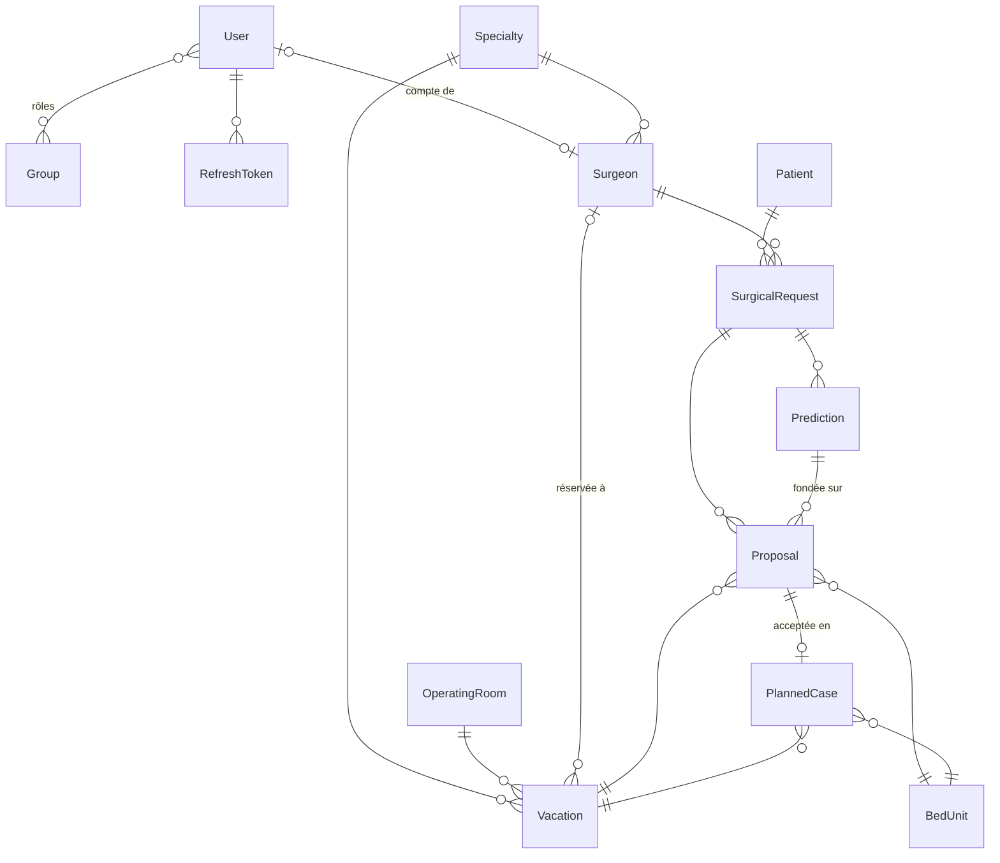
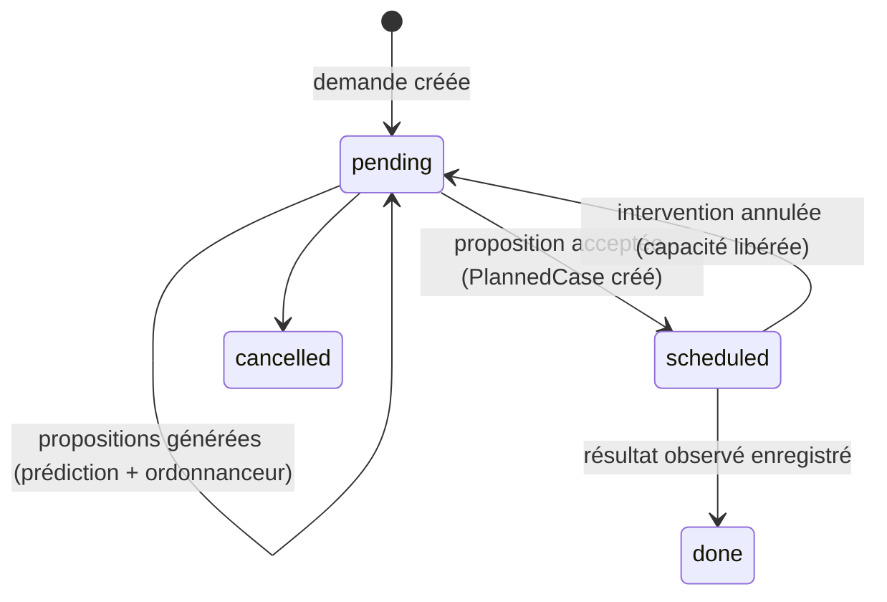

# KYST — Modèle de données

Ce document décrit les tables de l'API KYST (*Keep Your Surgeries Timely*), définies avec SQLModel dans `interface/api/*/models.py`. Les tables sont regroupées par domaine.

## Diagramme

## Cycle de vie d'une demande

## Comptes (`accounts`)

| Table | Rôle | Champs principaux |
|---|---|---|
| `User` | Utilisateur | `username` (l'email côté front), `email`, `full_name`, `disabled`, `validated` |
| `Group` | Rôle fixe | `user` (0, lecture), `doctor` (1), `admin` (2), `secretary` (3), `planner` (4, cadre de bloc / gestion des lits) |
| `RefreshToken` | Jeton de renouvellement | Seul le haché est stocké, avec rotation à chaque usage |

Les identifiants des rôles sont fixes, car le front s'appuie sur `admin = 2`.

## Ressources (`resources`)

| Table | Rôle | Champs principaux |
|---|---|---|
| `Specialty` | Spécialité chirurgicale | `name` |
| `OperatingRoom` | Salle d'opération | `name`, `default_specialty_id`, `active` |
| `Vacation` | Créneau d'une salle attribué à une spécialité | `room_id`, `specialty_id`, `surgeon_id` (optionnel), `date`, `start_time`, `duration_min` (240 par défaut) |
| `BedUnit` | Unité d'hébergement | `care_type` (`ambulatory` / `conventional`), `capacity` |
| `Surgeon` | Chirurgien | `name` (nom affiché ou code), `specialty_id`, `user_id` (optionnel) |

Deux vacations d'une même salle ne peuvent pas se chevaucher. Une vacation commence et finit le même jour.

## Clinique (`clinical`)

| Table | Rôle | Champs principaux |
|---|---|---|
| `Patient` | Patient pseudonymisé | `external_ref` (identifiant pseudonyme), `birth_year`, `sex` (1 = H, 2 = F) |
| `SurgicalRequest` | Intervention à programmer, telle que décrite en consultation | `patient_id`, `surgeon_id`, `specialty_id` (copiée du chirurgien), `principal_diagnosis` (CIM-10), `ccam_codes`, `intervention_type`, `earliest_date`, `latest_date`, `status` |
| `Prediction` | Sortie des modèles pour une demande | `room_minutes` (+ intervalle), `los_days` (jours calendaires inclusifs, + intervalle), `care_type`, `model_version`, `source` |

Minimisation des données : on ne stocke ni nom ni date de naissance, seulement l'année, qui suffit à calculer l'âge pour les prédictions.

## Planification (`planning`)

| Table | Rôle | Champs principaux |
|---|---|---|
| `Proposal` | Date proposée par l'ordonnanceur | `rank` (1 = date A), `vacation_id`, `bed_unit_id`, `admission_date`, `discharge_date`, `planned_minutes`, `score`, `reasons` (explications lisibles), `scheduler`, `status`, `decided_by`, `decided_at` |
| `PlannedCase` | Intervention programmée après acceptation humaine | `vacation_id`, `bed_unit_id`, `admission_date`, `discharge_date`, `planned_minutes`, `status`, `actual_room_minutes`, `actual_los_days` |

La capacité engagée se calcule à partir des `PlannedCase` au statut `planned` ou `done` :
- **minutes utilisées par vacation** : somme des `planned_minutes` ;
- **lits occupés par jour** : nombre de séjours entre `admission_date` et `discharge_date` inclus.

Le même calcul (`interface/api/planning/capacity.py`) sert à l'ordonnanceur, à la nouvelle vérification au moment de l'acceptation et aux indicateurs.

## Conventions

- Unités : `room_minutes` est le temps entre l'entrée et la sortie de salle, sans le temps de remise en état. `los_days` compte des jours calendaires inclusifs (ambulatoire = 1). Ce sont les mêmes conventions que `hospital_sim/contracts.py`.
- Les dates et heures sont stockées en UTC naïf. Le schéma est créé par `create_all` ; les migrations Alembic restent à faire (voir `docs/todo.md`).
