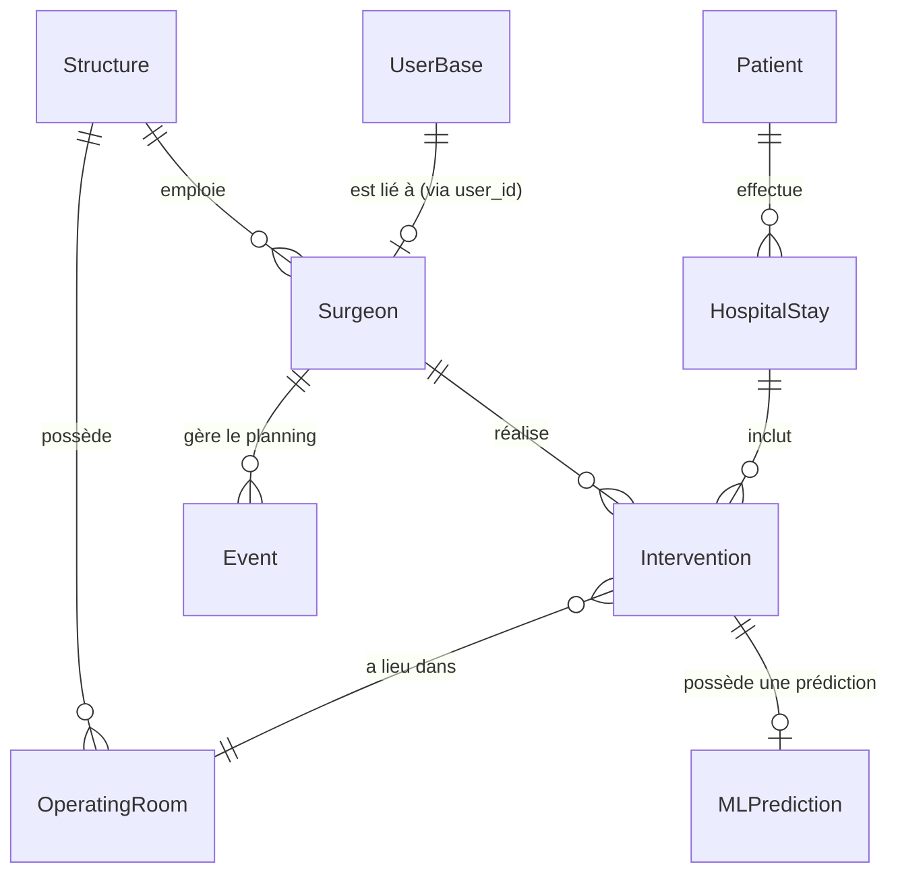

# Documentation de la Base de Données (Schémas)

Ce document décrit l'architecture des données et les modèles utilisés par l'API de planification (IA & Santé). L'architecture est divisée en quatre grands domaines : **Comptes Utilisateurs**, **Configuration & Ressources**, **Personnes**, et **Événements Médicaux**.

## Diagramme des Relations

---

## 1. Comptes Utilisateurs (`account/schemas.py`)

Gère l'authentification et les accès à l'API.

### `UserBase`
Représente un utilisateur enregistré dans le système.
* **id** (`UUID`) : Identifiant unique de l'utilisateur.
* **name** (`str`) : Prénom.
* **surname** (`str`) : Nom de famille.
* **email** (`EmailStr`) : Adresse email de connexion.
* **role** (`Roles`) : Rôle de l'utilisateur (`user`, `doctor`, `admin`).
* **validated** (`bool`) : Indique si le compte a été validé par un administrateur.

---

## 2. Configuration & Ressources (`configuration/schemas.py`)

Modélise l'établissement médical et ses infrastructures.

### `Structure`
Représente un hôpital ou une clinique.
* **nom** (`str`) : Nom de l'établissement.
* **bed** (`int`) : Capacité en lits d'hospitalisation classique.
* **ambulatory** (`int`) : Capacité en places d'ambulatoire.
* **staff** (`List[Surgeon]`) : Liste des chirurgiens rattachés.
* **operating_rooms** (`List[OperatingRoom]`) : Liste des salles d'opération de la structure.

### `OperatingRoom`
Représente une salle d'opération (bloc).
* **id** (`UUID`) : Identifiant de la salle.
* **name** (`str`) : Nom ou numéro (ex: "Salle 1").
* **equipment_type** (`str`) : Type d'équipement spécifique disponible.
* **is_active** (`bool`) : Statut d'activation de la salle.

---

## 3. Personnes (`people/schemas.py`)

Modélise les acteurs médicaux et les patients.

### `Patient`
Représente un patient anonymisé.
* **id** (`UUID`) : Identifiant unique et anonyme du patient.
* **date_naissance** (`date`) : Date de naissance.
* **sexe** (`int`) : Sexe du patient (`1` = Homme, `2` = Femme).
* **hospital_stays** (`List[HospitalStay]`) : Historique des séjours hospitaliers du patient.

### `Surgeon`
Représente un praticien / chirurgien.
* **id** (`UUID`) : Identifiant unique du chirurgien.
* **user_id** (`UUID`, optionnel) : ID du compte utilisateur lié (pour la connexion).
* **timetable** (`List[Event]`) : Calendrier des événements et disponibilités du chirurgien.
* **interventions** (`List[Intervention]`) : Liste des interventions chirurgicales assignées au chirurgien.

---

## 4. Événements & Séjours (`event/schemas.py`)

Cœur du système de planification incluant les prédictions IA.

### `HospitalStay` (Séjour Hospitalier)
Représente la période pendant laquelle le patient est admis à l'hôpital.
* **uuid** (`UUID`) : Identifiant du séjour.
* **patient_id** (`UUID`) : ID du patient admis.
* **entry_date** (`date`) : Date d'entrée dans l'établissement.
* **exit_date** (`date`, optionnel) : Date de sortie (si déjà sortie).
* **is_ambulatory** (`bool`) : Indique s'il s'agit d'un séjour ambulatoire.
* **interventions** (`List[Intervention]`) : Liste des opérations prévues ou réalisées pendant ce séjour.

### `Event` (Événement générique)
Représente un bloc de temps dans l'agenda d'un chirurgien.
* **uuid** (`UUID`) : Identifiant de l'événement.
* **owner** (`UUID`) : ID du chirurgien propriétaire de l'événement.
* **start_date** (`date`) : Date de début.
* **end_date** (`date`) : Date de fin.
* **duration** (`int`) : Durée en jours.

### `Intervention` (Hérite de `Event`)
Spécialise un événement pour représenter une chirurgie précise.
* **diagnostic_principal** (`str`) : Code ou description du diagnostic.
* **emergency** (`bool`) : Caractère d'urgence de l'opération.
* **patient_id** (`UUID`) : Patient opéré.
* **operating_room_id** (`UUID`, optionnel) : Salle d'opération réservée.
* **ai_prediction** (`MLPrediction`, optionnel) : Prédictions fournies par le modèle de Machine Learning.

### `MLPrediction`
Modélise la sortie du modèle d'Intelligence Artificielle de planification.
* **predicted_duration** (`int`) : Durée prédite de l'intervention (en minutes).
* **confidence_score** (`float`) : Indice de confiance de la prédiction (de 0.0 à 1.0).
* **model_version** (`str`) : Version du modèle IA utilisée.
