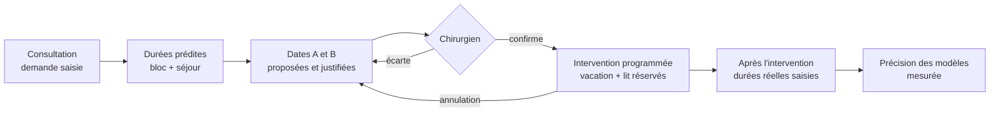

# KYST — Fonctionnalités

KYST (*Keep Your Surgeries Timely*) aide à programmer les interventions chirurgicales en tenant compte **à la fois du bloc opératoire et des lits**. Aujourd'hui, la programmation suit un « flux poussé » : on fixe l'intervention, puis on cherche un lit. KYST part au contraire de la capacité prévue pour proposer les meilleures dates (« flux tiré »). **Le chirurgien garde la décision** : KYST propose et explique, un humain confirme.

Ce document décrit ce que fait l'application, pour qui, et où en est chaque fonctionnalité :

| Statut | Signification |
| :--- | :--- |
| **Disponible** | Implémenté dans l'API et l'interface, testé |
| **Démonstration** | Fonctionne de bout en bout, mais avec des valeurs fixes (*fixtures*) en attendant les modèles et le solveur des autres équipes |
| **Prévu** | Pas encore implémenté (voir [`docs/todo.md`](../../docs/todo.md)) |

Les détails techniques sont dans [BDD.md](BDD.md) (modèle de données), [Routes.md](Routes.md) (API) et [Frontend.md](Frontend.md) (interface).

---

## Utilisateurs et rôles

Chaque compte est validé par un administrateur, qui lui attribue un ou plusieurs rôles.

| Rôle | Qui | Ce qu'il peut faire |
| :--- | :--- | :--- |
| Chirurgien | Praticien | Créer des demandes, obtenir et confirmer des dates, suivre ses interventions |
| Secrétariat | Secrétaire du chirurgien | Comme le chirurgien : saisie en consultation et confirmation des dates |
| Cadre bloc / lits | Cadre de bloc, gestionnaire des lits | Configurer les ressources, ouvrir les vacations, consulter demandes et interventions |
| Administrateur | Responsable de l'outil | Tout, plus la gestion des comptes et des rôles |
| Lecture | Compte validé sans autre rôle | Tableau de bord, planning du bloc et occupation des lits (agrégés, sans donnée patient) |

---

## Parcours principal : de la consultation à la sortie

1. **Pendant la consultation**, le chirurgien ou son secrétariat saisit la demande : patient pseudonymisé, diagnostic, actes prévus et fenêtre souhaitée.
2. **KYST prédit** le temps d'occupation de la salle, la durée de séjour et le type d'hébergement (ambulatoire ou conventionnel).
3. **KYST propose deux dates** (A, la meilleure, et B, une alternative). Chacune est compatible avec une vacation de la bonne spécialité et un lit disponible pendant tout le séjour, et chacune affiche ses raisons.
4. **Le chirurgien confirme une date.** KYST revérifie alors la capacité, qui a pu être prise entre-temps, puis réserve la place au bloc et le lit.
5. **En cas d'annulation**, le créneau et le lit sont libérés, et la demande redevient « à programmer ».
6. **Après l'intervention**, on saisit le temps réellement passé en salle et la durée réelle du séjour. Ces valeurs servent à mesurer la précision des prédictions.

---

## Fonctionnalités par domaine

### 1. Demandes d'intervention et propositions de dates

| Fonctionnalité | Statut | Détail |
| :--- | :--- | :--- |
| Saisie d'une demande en consultation | Disponible | Patient nouveau ou existant, chirurgien (sa spécialité détermine les vacations possibles), diagnostic CIM-10, 1 à 4 actes CCAM, type d'intervention, fenêtre « pas avant le » / « avant le ». Un chirurgien lié à un compte est présélectionné. |
| Dates proposées dès la création | Démonstration | Juste après la saisie, KYST calcule une prédiction et propose des dates. Le nombre de dates est réglable (`PROPOSAL_COUNT`, 2 par défaut). |
| Explication de chaque date | Démonstration | Remplissage de la vacation après ajout, pic d'occupation des lits pendant le séjour, marge d'urgence préservée. |
| Dates distinctes | Disponible | KYST propose des jours différents avant de proposer un second créneau le même jour. |
| Confirmer ou écarter une date | Disponible | La confirmation revérifie la capacité. Si le créneau n'est plus libre, KYST le dit et invite à recalculer. Les autres propositions sont alors remplacées. |
| Recalculer les propositions | Disponible | « Proposer de nouvelles dates » relance la prédiction et l'ordonnanceur sur l'état actuel du planning. |
| Aucune date trouvée | Disponible | Message explicite et pistes : élargir la date limite, ou ouvrir des vacations. Une liste vide ne prouve pas qu'aucune solution n'existe. |
| Annuler une demande ou une intervention | Disponible | L'annulation d'une intervention libère la vacation et le lit ; la demande est à reprogrammer. |
| Historique des propositions | Disponible | Propositions acceptées, écartées ou remplacées, avec la date de décision. |
| Liste des demandes par statut | Disponible | À programmer, programmées, réalisées, annulées. |
| Droits par chirurgien | Prévu | Aujourd'hui, tout le personnel clinique voit toutes les demandes. |

### 2. Prédictions

| Fonctionnalité | Statut | Détail |
| :--- | :--- | :--- |
| Temps en salle | Démonstration | Minutes de l'entrée à la sortie de salle, hors remise en état, avec un intervalle. |
| Durée de séjour | Démonstration | Jours calendaires inclusifs (ambulatoire = 1), avec un intervalle. |
| Type d'hébergement | Démonstration | Ambulatoire si le séjour prédit tient en une journée, sinon hospitalisation conventionnelle. |
| Traçabilité | Disponible | Chaque prédiction garde la version du modèle et sa source. L'interface signale clairement les valeurs de démonstration. |
| Modèles entraînés | Prévu | Ils seront branchés derrière les mêmes interfaces (`api/ai/contracts.py`), sans changer l'application. |

Les valeurs de démonstration (`api/ai/fixtures.json`) dépendent de la spécialité, du type d'intervention et de l'âge. Elles sont plausibles mais **ni ajustées ni calibrées** sur les données de l'hôpital.

### 3. Planning du bloc (vacations)

Une **vacation** est un créneau d'une salle attribué à une spécialité, et éventuellement à un chirurgien (4 h par défaut).

| Fonctionnalité | Statut | Détail |
| :--- | :--- | :--- |
| Vue hebdomadaire | Disponible | Salles en lignes, jours en colonnes. Chaque vacation affiche son horaire, sa spécialité, son chirurgien, une jauge de remplissage et le nombre d'interventions. Le week-end n'apparaît que s'il porte des vacations. |
| Marge pour les urgences | Disponible | Une part de chaque vacation (`EMERGENCY_MARGIN`, 10 % par défaut) reste libre ; elle est hachurée sur la jauge et l'ordonnanceur n'y place personne. |
| Indicateurs de la semaine | Disponible | Nombre de vacations, remplissage moyen, temps encore disponible à partir d'aujourd'hui (hors marge). |
| Ouvrir ou supprimer une vacation | Disponible | Réservé au cadre et à l'administrateur. Deux vacations d'une même salle ne peuvent pas se chevaucher. |
| Modèles hebdomadaires | Prévu | Générer la répartition des vacations par spécialité à partir de l'historique, et justifier chaque aménagement. |
| Planning du jour et ordre de passage | Prévu | Liste des patients par salle, actes, ordre et remise en état entre deux interventions. |

### 4. Lits et places

| Fonctionnalité | Statut | Détail |
| :--- | :--- | :--- |
| Occupation prévue par unité | Disponible | Lits occupés jour par jour (7, 14 ou 28 jours), à partir des interventions programmées, sur une échelle allant jusqu'à la capacité de l'unité. |
| Jours tendus et saturés | Disponible | Signalés par un symbole (▲ tendu à partir de 90 %, ■ saturé), une infobulle et un tableau des valeurs : jamais par la seule couleur. |
| Réservation de lit à la confirmation | Disponible | Le séjour prédit est réservé dans l'unité du bon type la moins chargée. |
| Lissage week-ends et vacances | Prévu | Aide à remplir les lits autour des week-ends et des vacances, et comparaison avec l'historique. |
| Urgences non programmées | Prévu | Elles ne sont pas encore comptées dans l'occupation. |

### 5. Tableau de bord

| Fonctionnalité | Statut | Détail |
| :--- | :--- | :--- |
| Chiffres du jour | Disponible | Lits conventionnels et places ambulatoires occupés, remplissage du bloc sur 7 jours, demandes à programmer. |
| Occupation à 14 jours | Disponible | Un graphique par unité de lits. |
| Précision des prédictions | Disponible | Écart moyen entre prédit et réel (temps en salle, séjour), nombre de sous- et surestimations, calculés sur les interventions réalisées. |
| Bandeaux d'information | Disponible | Mode démonstration actif, compte sans rôle. |

### 6. Ressources de l'établissement

| Fonctionnalité | Statut | Détail |
| :--- | :--- | :--- |
| Unités de lits | Disponible | Type (ambulatoire ou conventionnel), capacité modifiable, activation. |
| Salles d'opération | Disponible | Spécialité habituelle, activation. Une salle désactivée ne reçoit plus de proposition. |
| Chirurgiens | Disponible | Nom affiché, spécialité, lien avec un compte utilisateur (administrateur). |
| Spécialités | Disponible | Ajout et suppression. |
| Données de démonstration | Disponible | `just seed` crée 4 spécialités, 4 salles, 45 lits conventionnels, 21 places ambulatoires, 8 chirurgiens et 4 semaines de vacations, toutes synthétiques. |

### 7. Comptes et sécurité

| Fonctionnalité | Statut | Détail |
| :--- | :--- | :--- |
| Demande d'accès | Disponible | Un nouveau compte attend la validation d'un administrateur (`ACCOUNT_VALIDATION`). |
| Administration des comptes | Disponible | Validation, attribution des rôles, désactivation, suppression. |
| Profil | Disponible | Nom affiché et changement de mot de passe ; ce changement ferme toutes les sessions. |
| Sessions | Disponible | Les jetons sont gardés dans des cookies HttpOnly et renouvelés automatiquement. Le navigateur n'appelle jamais l'API directement. |
| Protection de la connexion | Disponible | Mots de passe hachés (Argon2), nombre de tentatives limité, réponses en temps constant contre l'énumération des comptes. |
| Journal d'audit | Prévu | Traçabilité des décisions et des accès aux données patient. |

### 8. Données et confidentialité

- **Patients pseudonymisés** : KYST ne stocke ni nom ni date de naissance, seulement un identifiant pseudonyme facultatif, l'année de naissance et le sexe, ce qui suffit aux prédictions.
- **Indicateurs agrégés** : les tableaux de bord et les indicateurs ne montrent aucune ligne patient. Seul le personnel clinique et le cadre voient les demandes.
- **Décisions tracées** : chaque proposition garde qui l'a acceptée ou écartée, et quand.
- **Pas de données réelles dans le dépôt** : les données de démonstration sont synthétiques.

---

## Règles de calcul

| Règle | Valeur actuelle |
| :--- | :--- |
| Durée d'une vacation | 240 min par défaut, modifiable vacation par vacation |
| Marge d'urgence | 10 % de chaque vacation (`EMERGENCY_MARGIN`) |
| Temps disponible d'une vacation | durée × (1 − marge) − temps déjà programmé |
| Admission | le jour de l'intervention (la règle d'admission la veille est prévue) |
| Occupation d'un lit | de l'admission à la sortie prévue, bornes incluses |
| Fenêtre de recherche | de « pas avant le » (au plus tôt aujourd'hui) à « avant le », ou 60 jours sans date limite (`SCHEDULING_HORIZON_DAYS`) |
| Choix entre les créneaux (démonstration) | Score qui favorise une vacation bien remplie, une unité de lits peu chargée et une date proche du souhait ; il sera remplacé par le solveur d'optimisation |

Tous ces réglages se trouvent dans [`interface/kyst.env`](../kyst.env).

---

## Correspondance avec le cahier des charges

| Fonction attendue (consignes) | Dans KYST |
| :--- | :--- |
| Outil web et smartphone pour donner une date au patient en consultation | Saisie de la demande et dates A/B, interface utilisable sur mobile. **Disponible** (dates en **démonstration**) |
| Prédire la durée de séjour, le temps opératoire et le type de capacité | Prédictions avec intervalles. **Démonstration**, en attendant les modèles |
| Proposer une ou deux dates optimales selon les lits et le bloc | Deux dates vérifiées sur la vacation et les lits, et justifiées. **Démonstration** (ordonnanceur glouton) |
| Liste des patients par vacation, durée totale, respect de la spécialité de la salle | Remplissage et nombre d'interventions par vacation, spécialité imposée. **Disponible** ; liste nominative et ordre de passage **prévus** |
| Distribution hebdomadaire des vacations par spécialité, aménagements justifiés | Vacations ouvertes une à une. Modèles hebdomadaires déduits de l'historique **prévus** |
| Gestion du remplissage des lits et places, week-ends et vacances | Occupation prévue par unité, jours tendus signalés. **Disponible** ; lissage week-ends et vacances **prévu** |
| Marge pour les urgences et les aléas | Marge réservée sur chaque vacation. **Disponible** ; prise en compte des aléas en temps réel (`hospital_sim`) **prévue** |
| Expliquer les propositions, le chirurgien garde la main | Raisons affichées et confirmation humaine obligatoire. **Disponible** |
| Apprendre de la réalité observée | Saisie des durées réelles et mesure de la précision. **Disponible** ; ré-entraînement **prévu** |
