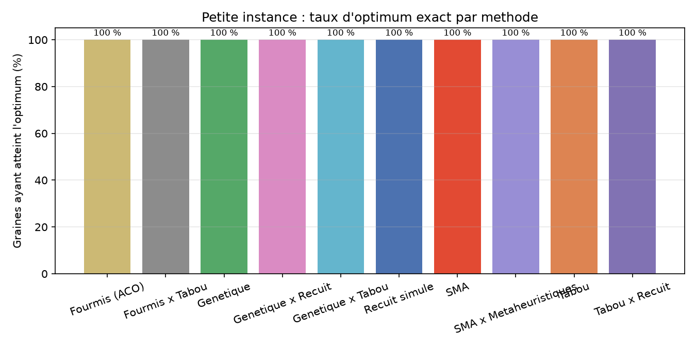
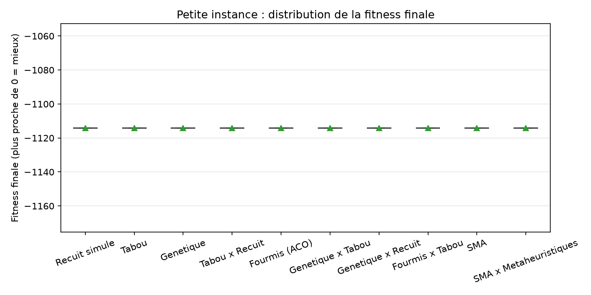
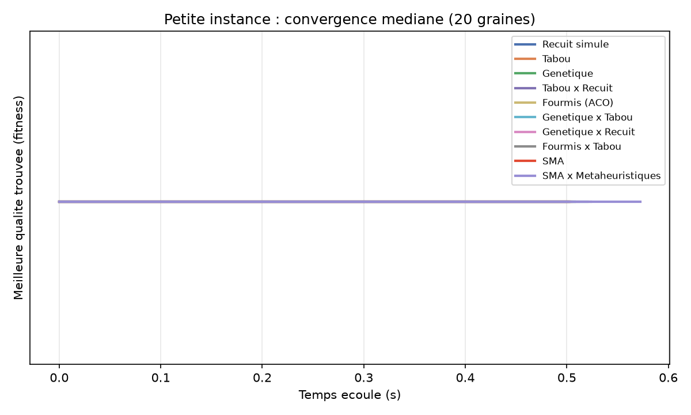
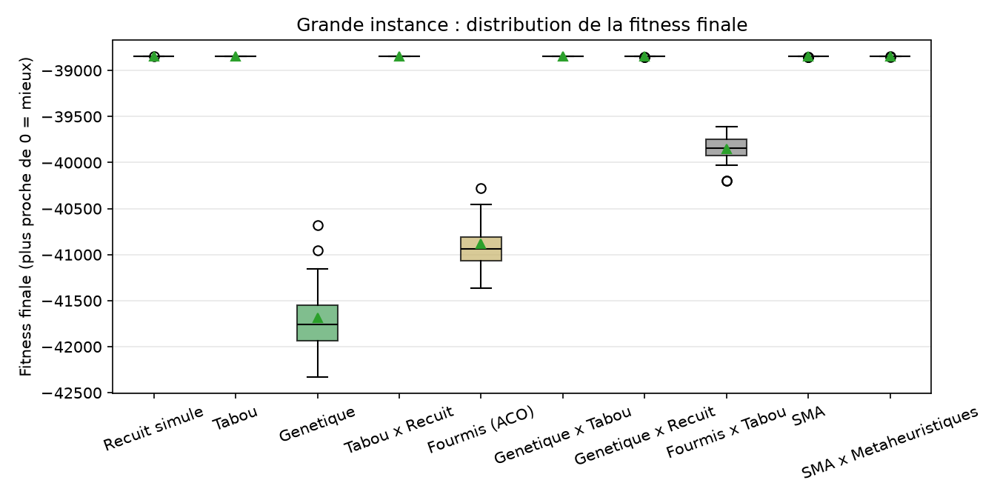
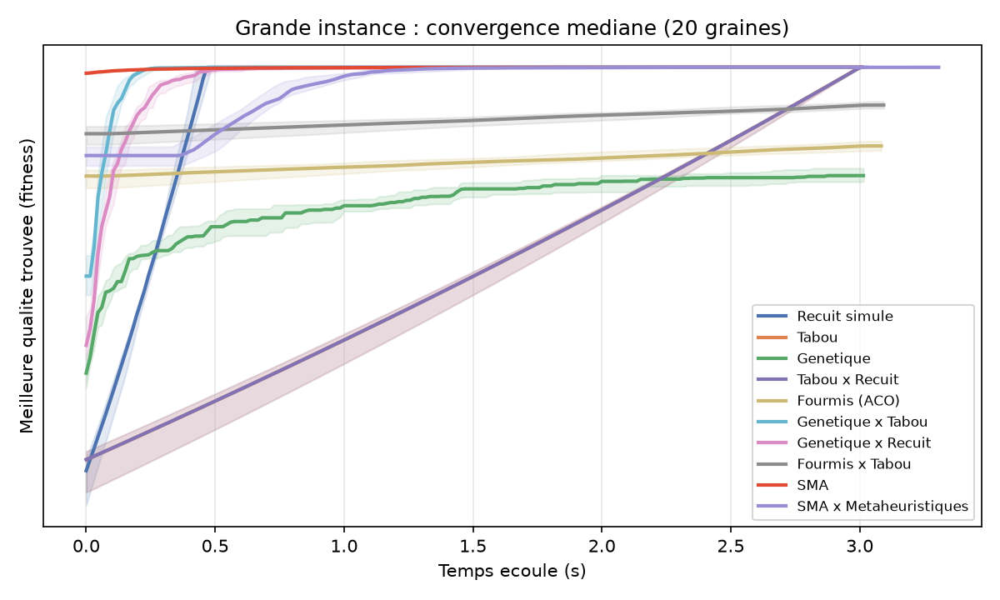
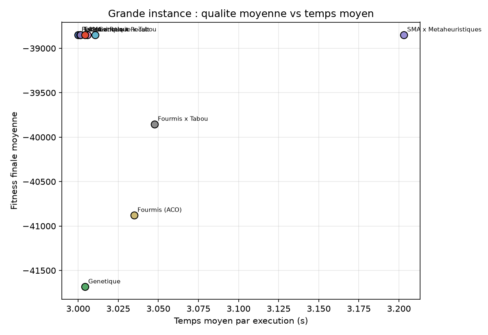
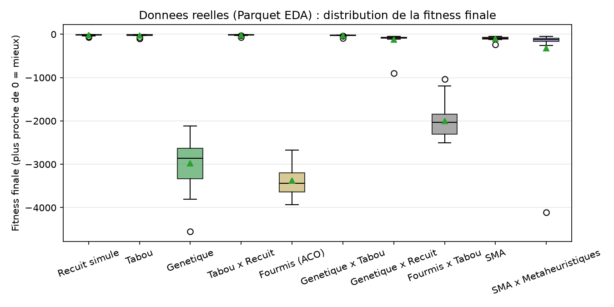
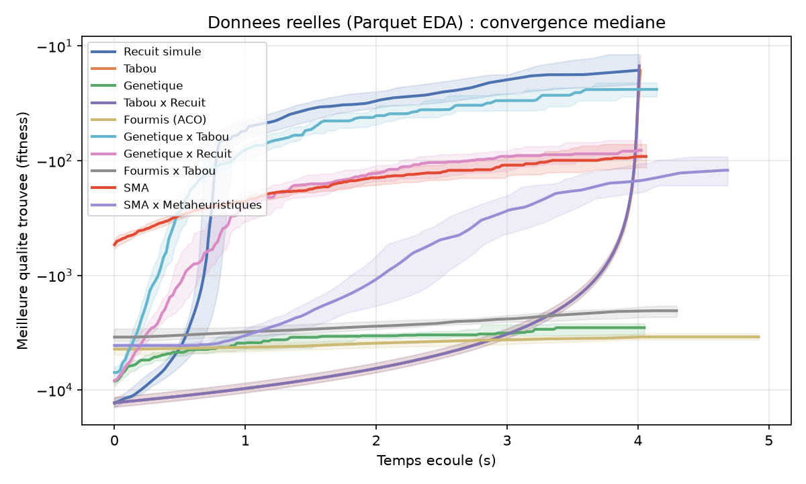
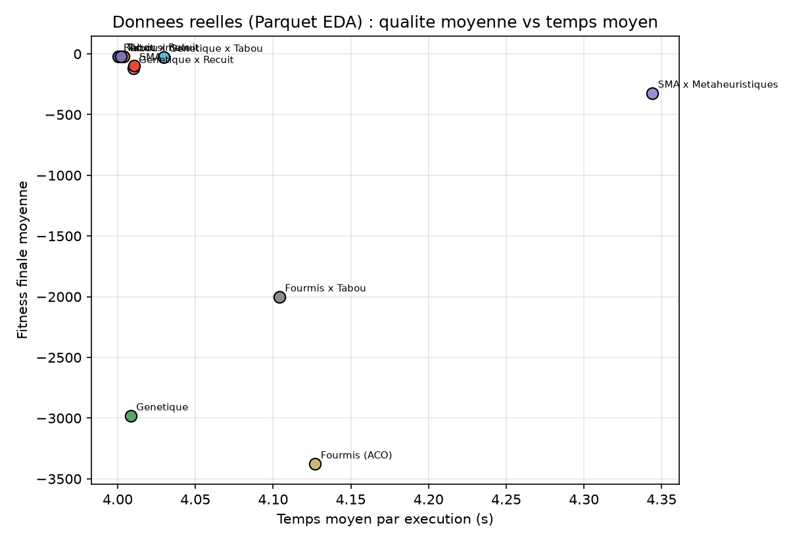

# Rapport comparatif — optimisation du planning de bloc opératoire

> **Archive du benchmark `meta_heuristics` avant l'assemblage avec la simulation
> historique.** Les résultats et figures ci-dessous décrivent les exécutions
> réalisées sur cette branche. Son instance exacte de 7 patients avait 4
> vacations, mais chaque patient n'avait qu'une vacation compatible :
> l'énumération du code ne comparait en réalité qu'une affectation admissible.
> Le `4^7` indiqué plus bas surestime donc le nombre de choix réellement
> examinés. L'instance de validation du code assemblé comporte 2 vacations
> compatibles par patient (128 combinaisons) ; relancer
> `optimiseur.run_benchmark` sur le code assemblé produit donc une nouvelle
> référence pour la petite échelle. Les trois nouveaux hybrides de salles ne
> font pas partie des résultats du simulateur Mesa publiés ailleurs.

Comparaison de dix méthodes d'optimisation sur le problème d'affectation
patients → vacations du module `optimiseur/`, à petite échelle (optimum exact),
à grande échelle synthétique, puis sur le jeu de données réelles prétraité, avec
un protocole à budget temps égal sur 20 graines.

## 1. Problème et fonction de qualité

Entrée : deux tables pandas.

- **patients** : `patient_id`, `specialite`, `duree_operatoire` (min),
  `duree_sejour` (jours) ;
- **vacations** : `vacation_id`, `jour`, `specialite`, `capacite_min` (min).

Une solution associe chaque patient à une vacation compatible avec sa
spécialité. Le coût pénalise trois tensions opérationnelles :

```
coût = w_vacation * dépassement_capacité_vacations     (w = 5.0)
     + w_lits     * dépassement_capacité_lits          (w = 3.0)
     + w_balance  * écart-type de la charge vacations  (w = 0.05)
```

La fitness renvoyée vaut `-coût` : **on maximise**, `0` correspondrait à un
planning parfaitement faisable et parfaitement équilibré. Sur les instances
testées, l'équilibrage souple empêche d'atteindre exactement 0, mais les
contraintes dures (capacités) sont respectées par les bonnes solutions
(`PlanningProblem.violations(solution) == (0, 0)`).

## 2. Méthodes comparées

| Méthode | Famille | Principe |
|---|---|---|
| Recuit simulé (`Recuit simule`) | métaheuristique | acceptation de Metropolis, température géométrique |
| Tabou (`Tabou`) | métaheuristique | meilleur voisin non tabou, mémoire des mouvements |
| Génétique (`Genetique`) | évolutionnaire | sélection, croisement, mutation, élitisme |
| Tabou × Recuit (`Tabou x Recuit`) | hybride d'origine | voisinage tabou + acceptation type recuit |
| Fourmis (`Fourmis (ACO)`) | construction | phéromones `tau^alpha * eta^beta`, évaporation + dépôt |
| Génétique × Tabou | mémetique | recherche tabou sur le meilleur individu de chaque génération |
| Génétique × Recuit | mémetique | recuit court sur le meilleur individu de chaque génération |
| Fourmis × Tabou | hybride | chaque itération ACO intensifie sa meilleure fourmi par recherche tabou |
| SMA | multi-agents | agents glouton / descente / aléatoire, tableau noir, migrations et redémarrages |
| SMA × Métaheuristiques | multi-agents | agents recuit / tabou / génétique / fourmis / hybride coopérant par tableau noir |

Les deux SMA sont construits sur **Mesa** (`mesa.Model`, `mesa.Agent`) avec un
tableau noir versionné et un coordinateur qui migre le meilleur planning vers
les agents sous la moyenne et redémarre partiellement en cas de stagnation.
Chaque agent possède son propre `random.Random` : les résultats sont
déterministes pour une graine donnée.

## 3. Protocole

- **Petite échelle (archive)** : 7 patients / 4 vacations listées. Chaque
  patient n'avait qu'une vacation compatible dans cette version : le calcul
  exact a énuméré une seule affectation admissible, et non `4^7` choix.
  Budget **0,5 s** par méthode et par graine.
- **Grande échelle** : 300 patients / 20 jours / 80 vacations
  (`generate_test_data(seed=42)`), capacité lits 42. Budget **3 s** par méthode
  et par graine.
- **Échelle réelle** : Parquet EDA prétraité (`resources/donnees_bloc_pretraitees.parquet`,
  40 derniers jours de la fenêtre), soit 582 patients / 280 vacations
  (7 spécialités × 40 jours), capacité 600 min par vacation, capacité lits 42.
  Budget **4 s** par méthode et par graine.
- **20 graines** (0 à 19), mêmes graines pour toutes les méthodes ; plafonds
  d'itération très élevés (`PLAFONDS_ITERATIONS`) pour que le **budget temps
  soit le seul frein**.
- Métriques : taux d'optimum (petite échelle) ou d'atteinte du meilleur connu
  (grande échelle), écart moyen, médiane, IQR, rang moyen par graine, temps
  moyen, convergence médiane.
- Matériel : Python 3.14, pandas 3.0, numpy 2.5, mesa 3.5, scipy 1.18,
  8 cœurs, exécutions séquentielles (un cœur par méthode).

Reproduction :

```bash
.venv/bin/python -m optimiseur.run_benchmark --graines 20 \
    --budget-petite 0.5 --budget-grande 3 \
    --n-patients 300 --n-days 20 \
    --out resultats/benchmark --figures rapport/figures

# variante échelle réelle (Parquet EDA présent localement)
.venv/bin/python -m optimiseur.run_benchmark --sans-petite --donnees-reelles \
    --graines 20 --budget-grande 4 --horizon 40 --capacite-min 600 \
    --out resultats/benchmark_reel --figures rapport/figures
```

Métadonnées et références : `resultats/benchmark/benchmark_meta.json`
(meilleur connu grande échelle = `-38847.195`, optimum exact petite échelle =
`-1114.096`) et `resultats/benchmark_reel/benchmark_meta.json` (meilleur connu
échelle réelle = `-8.783`).

## 4. Résultats — petite échelle (optimum exact)

**Les dix méthodes retrouvent l'unique affectation admissible sur les 20 graines** : taux de
réussite 100 %, écart moyen 0, écart-type `2e-13` au niveau de l'erreur de
représentation flottante. Le classement est donc entièrement à égalité
(rang moyen 5,5 pour toutes les méthodes).





Cette instance sert seulement de **test de cohérence de l'affectation** : elle
ne discrimine pas les méthodes et ne démontre pas leur capacité de recherche.
Le budget de
0,5 s est ici bien supérieur au temps nécessaire (les méthodes à itérations
plafonnées terminent souvent avant) ; la convergence médiane montre que
l'optimum est trouvé en quelques dizaines de millisecondes.



## 5. Résultats — grande échelle (300 patients, 80 vacations)

Référence = meilleure fitness observée sur l'ensemble des exécutions
(`-38847.195`, atteinte par le recuit simulé sur 1 graine). Les écarts sont
donc positifs ; « écart min » est le plus petit écart à la référence sur les
20 graines.

| Méthode | Médiane | Écart moyen | Écart min | IQR | Rang moyen | Temps moyen |
|---|---:|---:|---:|---:|---:|---:|
| Recuit simulé | -38847.209 | **0.015** | **0.000** | 0.008 | **1.25** | 3.00 s |
| Tabou × Recuit | -38847.211 | 0.018 | 0.005 | 0.013 | 1.75 | 3.00 s |
| Tabou | -38847.418 | 0.240 | 0.145 | 0.070 | 3.55 | 3.00 s |
| Génétique × Tabou | -38847.426 | 0.261 | 0.125 | 0.106 | 3.75 | 3.01 s |
| SMA | -38847.549 | 1.078 | 0.189 | 0.194 | 5.05 | 3.00 s |
| SMA × Métaheuristiques | -38848.207 | 1.196 | 0.823 | 0.154 | 6.15 | 3.20 s |
| Génétique × Recuit | -38848.336 | 2.031 | 0.893 | 0.323 | 6.50 | 3.01 s |
| Fourmis × Tabou | -39839.578 | 1006.004 | 761.123 | 180.9 | 8.00 | 3.05 s |
| Fourmis (ACO) | -40939.919 | 2031.187 | 1427.042 | 256.1 | 9.00 | 3.03 s |
| Génétique | -41758.799 | 2836.179 | 1836.162 | 380.1 | 10.00 | 3.00 s |







### Lecture des résultats

1. **Le recuit simulé et l'hybride Tabou × Recuit dominent** : écarts moyens
   inférieurs à 0,02 unité (soit moins de 0,0001 % du coût total) et rangs
   moyens 1,25 et 1,75. Sur cette instance, la marche aléatoire acceptant des
   dégradations explore efficacement le plateau de solutions quasi optimales.
2. **Tabou et Génétique × Tabou suivent de près** (écarts 0,24 et 0,26). Le
   mémetique génétique × tabou fait mieux que le génétique seul d'un facteur
   ~10 000 sur l'écart moyen : l'intensification locale corrige la faible
   pression de sélection du GA sur ce paysage très plat.
3. **Les SMA sont compétitifs mais paient leur coût par étape** : avec le même
   budget de 3 s, le tableau noir et les migrations amènent le SMA simple et le
   SMA × métaheuristiques à des écarts d'environ 1 unité, au niveau du
   génétique × recuit. Un pas de SMA hybride exécute cinq quanta de
   métaheuristiques, donc peu d'itérations de coordination tiennent dans le
   budget ; à budget temps plus large, le mécanisme de migration/redémarrage
   devrait prendre l'avantage (voir perspectives).
4. **Fourmis et génétique souffrent du budget** : la construction d'une
   solution par fourmi est coûteuse (300 patients × 11 vacations × phéromones),
   et le GA converge lentement sur un paysage dominé par un plateau. Fourmis ×
   Tabou divise l'écart de l'ACO par deux, mais reste loin des meilleures
   méthodes.
5. **Le classement est très resserré en haut de tableau** : les cinq premières
   méthodes tiennent dans un écart moyen de ~1,2 unité sur un coût de ~38 800,
   ce qui correspond à des plannings opérationnellement très proches. Les
   différences de rang doivent donc être lues avec la dispersion (IQR) : le SMA
   simple a un IQR de 0,19, proche de Tabou (0,07) et de Génétique × Tabou
   (0,11), tandis que le GA et l'ACO ont des IQR de 380 et 256, signe d'une
   forte variabilité selon la graine.

### Synthèse

- **Fiabilité** : les 10 méthodes atteignent l'optimum exact à petite échelle ;
  aucune ne viole les contraintes dures sur les instances faisables.
- **Qualité à budget égal** : recuit simulé ≈ Tabou × Recuit > Tabou ≈
  Génétique × Tabou > SMA ≈ SMA × Métaheuristiques ≈ Génétique × Recuit ≫
  Fourmis × Tabou > Fourmis > Génétique.
- **Apport des hybridations** : net pour Génétique × Tabou (vs Génétique) et
  Fourmis × Tabou (vs ACO) ; plus modeste pour Génétique × Recuit sur ce jeu
  d'instances.
- **Apport des SMA** : résultats solides et déterministes, mais la coordination
  multi-agents n'est pas gratuite en temps ; son intérêt principal est
  l'adaptation dynamique (section 7) et la robustesse par redémarrages.
- **Échelle réelle** : hiérarchie confirmée (recuit ≈ Tabou × Recuit > Tabou >
  Génétique × Tabou), mais seules les méthodes à acceptation de dégradations
  approchent la référence ; le génétique et l'ACO restent à plus de 2 000 unités
  sur une instance dont le couloir faisable est très étroit (section 6).

## 6. Résultats — échelle réelle (582 patients, 280 vacations)

Instance construite par `data_bridge.prepare_inputs` sur le Parquet EDA
(40 derniers jours, capacité 600 min/vacation) : **582 patients**, **280
vacations** (7 spécialités × 40 jours), capacité lits 42. Budget **4 s** par
méthode et par graine, 20 graines. Référence = meilleure fitness observée
(`-8.783`, atteinte par Tabou × Recuit, graine 19).

| Méthode | Médiane | Écart moyen | Écart min | IQR | Rang moyen | Temps moyen |
|---|---:|---:|---:|---:|---:|---:|
| Recuit simulé | -16.278 | **11.740** | **0.003** | 9.76 | **1.85** | 4.00 s |
| Tabou × Recuit | -14.883 | 10.118 | 0.000 | 6.76 | 2.05 | 4.00 s |
| Tabou | -16.354 | 15.245 | 0.064 | 11.97 | 2.65 | 4.00 s |
| Génétique × Tabou | -23.898 | 18.574 | 6.145 | 6.76 | 3.50 | 4.03 s |
| Génétique × Recuit | -81.124 | 111.230 | 39.354 | 30.63 | 5.50 | 4.01 s |
| SMA | -91.818 | 89.653 | 42.043 | 42.78 | 5.85 | 4.01 s |
| SMA × Métaheuristiques | -121.200 | 315.057 | 45.255 | 72.04 | 6.70 | 4.34 s |
| Fourmis × Tabou | -2033.837 | 1992.898 | 1031.515 | 470.0 | 8.00 | 4.10 s |
| Génétique | -2857.546 | 2972.511 | 2112.717 | 710.6 | 9.20 | 4.01 s |
| Fourmis (ACO) | -3438.822 | 3368.772 | 2662.637 | 441.8 | 9.70 | 4.13 s |







### Lecture des résultats

1. **Le classement est le même qu'à grande échelle en tête de tableau** :
   Recuit simulé (rang 1,85 ; écart min 0,003) et Tabou × Recuit (rang 2,05 ;
   détient la référence) dominent, suivis de Tabou (2,65) et Génétique × Tabou
   (3,50). L'écart min du recuit à la référence (0,003) est de l'ordre du bruit
   d'arrêt au budget : ces trois méthodes sont à égalité pratique.
2. **L'instance réelle est un couloir faisable étroit.** La meilleure solution
   reproduite (Tabou × Recuit, graine 19, budget 4 s) est **faisable** :
   `violations == (0, 0)`, occupation maximale des lits 42/42 et charge maximale
   d'une vacation 589/600 min. La fitness résiduelle (`-8.77`) ne contient donc
   plus que le terme souple d'équilibrage. À l'opposé, l'affectation naïve
   « premier choix » coûte `-200 291` (39 148 min de dépassement de vacations et
   1 493 lits-jours). C'est ce couloir étroit qui explique l'effondrement du
   génétique et de l'ACO : leurs constructions peinent à trouver des plannings
   faisables, là où le recuit accepte des dégradations pour longer la frontière.
3. **Les hybrides de construction restent distancés** : Fourmis × Tabou divise
   l'écart de l'ACO par ~1,7, mais reste à ~2 000 unités ; Génétique × Tabou est
   en revanche au niveau du tabou seul (écart moyen 18,6 contre 15,2).
4. **Les SMA occupent le milieu de tableau** (écarts 90 à 315, rangs 5,9 et
   6,7) : meilleurs que le génétique et l'ACO, mais le coût d'un pas de
   coordination reste pénalisant face aux méthodes locales à 4 s.
5. **La dispersion est plus forte que sur l'instance synthétique** (IQR du
   recuit 9,8 contre 0,008) : la référence `-8.783` n'est atteinte que par une
   seule exécution sur 200 (Tabou × Recuit, graine 19), signe d'un paysage réel
   nettement plus rugueux que le synthétique.

## 7. Re-planification dynamique (`hospital_sim`)

Le pont `optimiseur/coordination_bridge.py` branche l'optimiseur sur le
`Coordinator` asynchrone de `hospital_sim` (issue de `main`) :

- `EtatBlocAdapter` applique les événements hospitaliers (vacation indisponible,
  annulation, arrivée en urgence, séjour prolongé, dépassement de bloc) à un
  état versionné ;
- `PlanificateurOptimiseur` exécute la méthode choisie dans un thread
  (`asyncio.to_thread`) pour ne pas bloquer la boucle d'événements ;
- `ValidateurBloc` vérifie les contraintes dures (couverture des patients,
  vacations connues, capacités vacations et lits) avant **acceptation
  explicite** par le coordinateur.

Démonstration de bout en bout
(`.venv/bin/python -m optimiseur.run_coordination_demo`) : une vacation devient
indisponible, le planning est recalculé et accepté, puis une urgence est
ajoutée et le planning est à nouveau recalculé et accepté. Métriques obtenues :
`events_applied = 2`, `validation_rejections = 0`, `stale_results = 0`,
`timeouts = 0`. Le planificateur utilisé dans la démo est le SMA ×
métaheuristiques, mais n'importe laquelle des dix méthodes peut être branchée.

## 8. Limites

- Les instances synthétiques (`generate_test_data`) restent éloignées du bloc
  réel ; l'instance réelle de la section 6 est un premier rapprochement mais
  repose sur un **proxy de spécialité** dérivé de la 1re lettre CCAM, à valider
  cliniquement, et sur des vacations générées « jour × spécialité ».
- Le budget temps est le seul frein en benchmark ; les résultats dépendent donc
  du budget. À 3 s, l'ACO et le GA n'atteignent pas leur régime stationnaire,
  alors qu'à budget plus large leur écart diminuerait.
- Le critère souple d'équilibrage (`w_balance * écart-type`) est plat sur de
  grandes plages ; le classement fin dépend de petites différences de coût. Les
  poids devront être validés cliniquement.
- Le modèle ignore les engagements fixes (chirurgien, matériel) ;
  `fixed_commitments` du pont est un point d'extension documenté.
- Les SMA fixent un plafond de pas de coordination (`n_steps`) en plus du
  budget temps ; à très gros volume, la latence d'un pas peut dépasser la
  granularité d'annulation souhaitée.

## 9. Perspectives

- Réglage des poids (`w_vacation`, `w_lits`, `w_balance`) et de la capacité des
  vacations avec les équipes, sur l'instance réelle déjà branchée.
- Budgets plus longs et profils de convergence complets pour départager les
  cinq meilleures méthodes.
- SMA avec liste d'événements réactive (le coordinateur peut annuler un
  calcul), priorités d'agents et mémoire des migrations.
- Utilisation du pont comme base d'une boucle de simulation journalière
  (urgences, indisponibilités, dépassements) avec indicateurs opérationnels
  (retards, occupation lits, marges d'urgence).

## 10. Reproductibilité

```bash
# Suite de tests (130 tests)
.venv/bin/python -m unittest discover -t . -s tests -v

# Démonstration des 10 méthodes + optimum par force brute
.venv/bin/python -m optimiseur.run_demo --toutes --budget 1 --out resultats

# Campagne complète synthétique (sections 4-5)
.venv/bin/python -m optimiseur.run_benchmark --graines 20 \
    --budget-petite 0.5 --budget-grande 3 \
    --out resultats/benchmark --figures rapport/figures

# Campagne échelle réelle (section 6)
.venv/bin/python -m optimiseur.run_benchmark --sans-petite --donnees-reelles \
    --graines 20 --budget-grande 4 --horizon 40 --capacite-min 600 \
    --out resultats/benchmark_reel --figures rapport/figures

# Re-planification dynamique
.venv/bin/python -m optimiseur.run_coordination_demo
```

Sorties brutes : `resultats/benchmark/{petite,grande}_{graines,resume}.csv`,
`resultats/benchmark_reel/reelle_{graines,resume}.csv` et les
`benchmark_meta.json` (non versionnés) ; figures versionnées dans
`rapport/figures/`.
