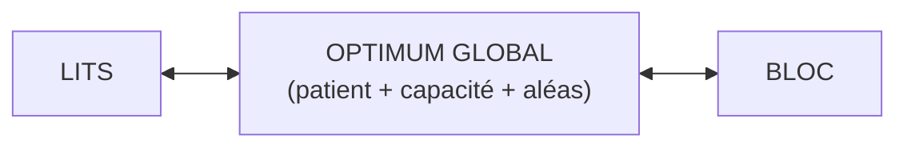
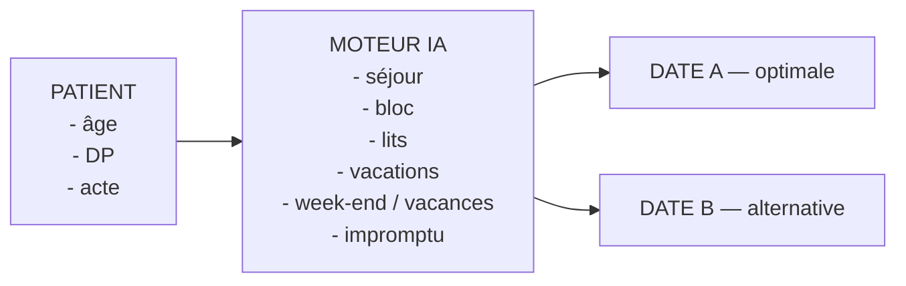
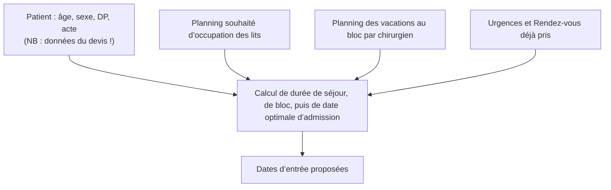

# Le bloc opératoire : un problème d’optimisation
## Des ressources rares, interdépendantes et variables dans le temps

| 👤 PATIENT | 👨‍⚕️ CHIRURGIEN | 🏥 BLOC | 🛏️ LITS | 👥 ÉQUIPES |
| :---: | :---: | :---: | :---: | :---: |
| parcours | planning | salle + vacation | ambulatoire + classique | ressources humaines |

> Le défi : passer de plusieurs plannings séparés à une optimisation globale des flux.

---

# Aujourd’hui : une logique de « flux poussé »
## La décision d’admission part du planning du chirurgien

> « J’ai une intervention à programmer → il faut ensuite trouver un lit. »

Le système absorbe les décisions prises en amont au lieu de réguler la demande selon la capacité disponible.

---

# Le résultat : des pics et des creux

## Le remplissage des lits de chirurgie est erratique

Même capacité, demande très variable : la difficulté est autant le timing que le volume.

**Lits chirurgicaux occupés — hors ambulatoire**
- Capacité : 45 lits
- Occupation variable (ex: 15 à 45 lits)

**Ambulatoire**
- Capacité 21 lits

---

# Le casse-tête des vacances
## Prévoir combien de lits ouvrir reste complexe et aléatoire

| VACANCES | WEEK-END | BLOC |
| :---: | :---: | :---: |
| ? lits | ? sorties | ? interventions |

- **Trop de lits ouverts** → ressources inutilisées
- **Pas assez de lits** → saturation et tensions

> L’objectif n’est pas seulement d’avoir assez de ressources : **il faut les utiliser au bon moment.**

---

# Changer de logique : passer au « flux tiré »
## Proposer les meilleures dates à partir de la capacité prévisionnelle

| FLUX POUSSÉ | FLUX TIRÉ |
| :--- | :--- |
| Planning du chirurgien → recherche de capacité | Capacité disponible → proposition de date |

> Le chirurgien conserve la décision. L’IA lui propose de meilleures options.

---

# Le vrai problème : optimiser les lits ET le bloc
## Deux ressources interdépendantes, un seul objectif global

- Optimiser *uniquement* le bloc peut saturer les lits.
- Optimiser *uniquement* les lits peut dégrader le bloc.

---

# Les données existent déjà
## Chaque séjour passé constitue une information pour prévoir le prochain

- **ADMINISTRATIF** : âge, sexe, géographie, entrée/sortie
- **SÉJOUR** : durée, provenance, destination
- **MÉDICAL** : DP, DA, actes CCAM
- **GROUPAGE** : GHM, GHS, GENRSA

> Le défi : transformer ces données historiques en capacité de prévision et de décision.

---

# Prévoir le patient avant son admission
## Première brique : des modèles prédictifs

| DURÉE DE SÉJOUR | TEMPS OPÉRATOIRE | TYPE DE CAPACITÉ |
| :---: | :---: | :---: |
| combien de nuits ? | combien de temps au bloc ? | ambulatoire ou classique ? |

> Prévoir ne suffit pas : il faut ensuite choisir.

---

# De la prédiction à la décision
## Pour chaque patient : une ou deux dates d’admission optimales

> L’IA aide à décider ; le chirurgien garde la main.

---

# Optimiser chaque vacation du bloc
## Une vacation de 4 heures : ni vide, ni surchargée

**VACATION — 4 h**

| Patient A | Patient B | Patient C | Marge |
| :---: | :---: | :---: | :---: |
| 1h10 | 0h55 | 1h00 | 0h55 |

Pour chaque salle : spécialité → patients → actes → durée → temps total

> Objectif : maximiser le temps utile tout en conservant une marge pour l’imprévu.

---

# Répartir intelligemment les vacations
## Comparer la capacité offerte à la demande historique et prévisionnelle

| Spécialité | Demande |
| :--- | :--- |
| Orthopédie | demande 3.3 |
| Digestif | demande 2.6 |
| Urologie | demande 2.8 |
| ORL | demande 1.4 |

> Si une modification est proposée, l’outil doit en expliquer la raison.

---

# Un outil simple au moment où la décision est prise
## Web + smartphone pour le chirurgien ou son secrétariat

> « Voici les deux meilleures dates compte tenu des lits et du bloc. »

---

# La cible : lisser l’occupation des lits
## Passer d’une courbe subie à une courbe pilotée

| AUJOURD’HUI | DEMAIN |
| :---: | :---: |
| 📉 Pics / creux | 📊 Occupation lissée |

> Ambition de travail : tendre vers une variabilité autour de ±2 lits, urgences comprises, après entraînement et validation sur les données réelles.

---

# Les bénéfices : une organisation plus sereine
## Une optimisation qui profite à tout l’écosystème

| 🤕 PATIENTS | 👨‍⚕️ MÉDECINS | 👥 PERSONNEL | 🏥 ÉTABLISSEMENT |
| :--- | :--- | :--- | :--- |
| moins d’attente moins de reports | dates proposées meilleure visibilité | charge plus régulière moins de tensions | ressources maximisées moins de pics / creux |

> Même capacité. Meilleure utilisation.

---

# Le vrai défi : construire le moteur d’optimisation
## IA prédictive + recherche opérationnelle + simulation + logiciel

- **PRÉDIRE** : séjour, bloc
- **PLANIFIER** : patients, salles, lits
- **OPTIMISER** : capacité, marges
- **S’ADAPTER** : urgences, retards
- **EXPLIQUER** : pourquoi cette décision ?

> Un problème d’ingénierie à la frontière de l’IA, de l’optimisation combinatoire et de la simulation.

---

# Le défi pour les jeunes ingénieurs
## Construire le « GPS » du bloc opératoire

| OÙ EN SOMMES-NOUS ? | OÙ ALLONS-NOUS ? | QUE FAIRE MAINTENANT ? |
| :--- | :--- | :--- |
| Occupation actuelle + planning | Prévision des prochaines semaines / mois | Meilleure date, meilleure vacation |

> L’objectif n’est pas de remplacer les professionnels. **C’est de leur donner une capacité de décision augmentée.**

---

# Un système qui apprend de l’hôpital
## Décision, réalité observée et amélioration continue

---

# Ne plus subir les flux. Les anticiper. Les optimiser.
## Une ambition d’ingénierie au service des patients et des équipes

- moins de pics
- moins de creux
- moins d’attente
- meilleure utilisation des ressources

> Transformer des données hospitalières en décisions opérationnelles intelligentes.

---

# L’algorithme

---

# Les fonctions attendues de la solution

- Un outil (web et smartphone) qui permette au chirurgien ou à sa secrétaire de donner une date de rendez-vous au patient lors de la consultation préparatoire.
- Un outil de gestion optimale du bloc qui précise pour chaque salle :
  - La liste des patients par vacation avec les actes et durée totale des interventions (optimale : 4 heures) en respectant la spécialité de chaque salle.
  - La distribution hebdomadaire des vacations pour chaque spécialité (à déduire de l’historique et aménager si nécessaire). En cas d’aménagement, en étayer la raison.
- Un outil de gestion du remplissage des lits et places avec optimisation des remplissages pour le week-end et les vacances.

---

# Les effets attendus

- **Proposition intelligente de dates/blocs** pour chaque patient, basée sur la disponibilité des lits et des blocs opératoires.
- **Gestion proactive plutôt que réactive** : prévision des occupations à venir.
- **Gestion des ressources** : fin des « pics » et « creux » d'occupation. Impact très important sur le nombre de lits disponibles nécessaires.
- **Satisfaction optimale des patients** : moins d'attente.
- **Sérénité médicale** : meilleure visibilité et organisation.
- **Sérénité du personnel** : Gestion plus harmonieuse des hospitalisations.
- **Économies** : maximisation des ressources.
